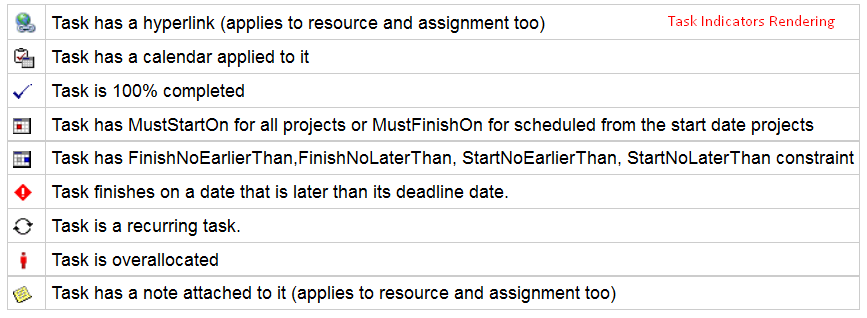

{} 

Aspose.Tasks for C++ API provides the capability to render project data to PDF format. This article gives a detailed overview of the variety of options available in Aspose.Tasks for exporting projects to PDF.

{} 

## **Saving a Project as a PDF**
The [Project ](https://apireference.aspose.com/tasks/cpp/class/aspose.tasks.project/)class exposes the Save method which is used to save a project in various formats. The Save method allows you to render project data to PDF using the SaveFileFormat enumeration type.

To save a project to PDF:

1. Load a Microsoft Project file.
2. Save the project to PDF using SaveFileFormat.PDF.
### **Programming Sample**
The following lines of code demonstrate how to achieve this using C++.



## **Fitting Contents to Cell Size**
It is common that a task (or resource) name is so long that it is truncated when project views are rendered. Aspose.Tasks for C++ API provides the FitContent property in the SaveOptions class to avoid truncation of task and resource names. The code example given below renders a project to PDF format with the FitContent property set to true.



## **Printing or Hiding Legends when Rendering**
To let you print or hide the legends on each page, the SaveOptions class provides the LegendOnEachPage property. If this flag is set to true, legends are printed on each page in the output file.


## **Supported Graphical Column Indicators**
Aspose.Tasks for C++ API draws graphical column indicators when rendering project data to output PDF. The following graphical indicators are supported by Aspose.Tasks:

|**Indicator Type**|**Graphical Indicator**|
| :- | :- |
|Task Indicators||
|Resource Indicators||
|Assignment Indicators||
## **Saving to Multiple PDF Files**
To save project data to multiple PDF files, set the SaveToSeparateFiles flag to true.


## **Customizing TextStyle for Project Data**
Aspose.Tasks for C++ API allows developers to customize the text style for overallocated resources. By default, the style used for overallocated resources is similar to Microsoft Project (MSP), that is, red and bold. TextItemType.OverallocatedResources makes it possible to customize the color and style for the overallocated resources.


## **Customizing Date Formats**
Aspose.Tasks for C++ API allows developers to customize the date format using the DateFormat enumerator when rendering project data.


## **Setting Default Font**
Setting default font during rending of documents helps when a font is not found. In such a case, the default font replaces the missing font, and output is not affected. Aspose.Tasks for C++ API lets you specify the default font using the DefaultFontName property of the PdfSaveOptions as shown in the following code sample.


