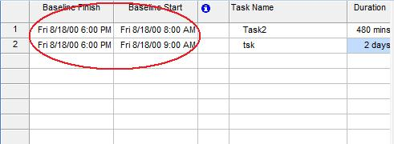

## **Baseline Task Scheduling**
The Start and Finish properties exposed by the [TaskBaseLine](https://apireference.aspose.com/tasks/cpp/class/aspose.tasks.task_baseline) class are used to read and write a task's start and finish dates when the baseline was saved. Both properties support the DateTime datatype.

After saving a baseline, the task baseline schedule can be viewed in Microsoft Project:

1. From the **View** menu, select **More Views** and then **Task Entry**.
2. From the **Insert** menu, select **Columns**.
3. Add the desired columns.

## **Getting Task Baseline Schedule using Aspose.Tasks**
The code example given below demonstrates the task baseline schedule in a console window after traversing a task's baselines.


