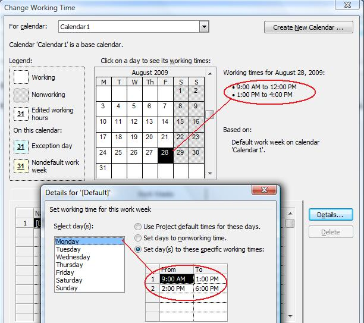
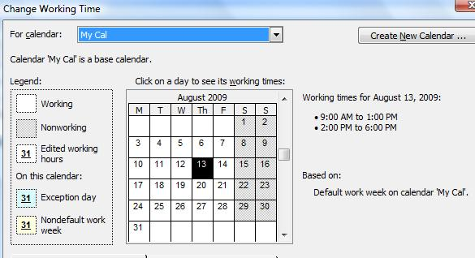

## **Creating a Calendar**
Calendars and other information is used by Microsoft Project to build project schedules. With Aspose.Tasks, adding a calendar to a project is easy. The Calendar class constructors allow you to assign an ID or a calendar name to the calendar, or use the default constructor. The options are described below.

There are three ways of creating a calendar in Aspose.Tasks. The [Calendar](https://apireference.aspose.com/tasks/cpp/class/aspose.tasks.calendar) class exposes the following three constructors:

- Calendar() – Default constructor.
- Calendar(int id) – Creates a calendar with an ID.
- Calendar(string name) – Creates a calendar with a name.

The following code creates three different calendars, one using each constructor.
Open the output file in Microsoft Project and, on the **Project** menu, select **Project Information** to access the calendars. 

## **Project information showing the calendars info** 



## **Defining Weekdays for Calendar**
Microsoft Project keeps track of which days are considered weekdays in a calendar so that it can calculate project end dates and so on. Aspose.Tasks for C++ API allows developers to define weekdays for a calendar associated with a project.

The Days collection exposed by the Calendar class is used to define the weekdays for a calendar. The Days collection represents an array list of WeekDay objects.

The CreateDefaultWorkingDay method exposed by the WeekDay class can further be implemented to define the default day timings, while the FromTime and ToTime properties exposed by the WorkingTime class is used to define the specific timing for a day. FromTime and ToTime support the DateTime datatype.

The code samples below set weekdays for a project. After running the code, open the output file in Microsoft Project and, on the **Tools** menu, select **Change Work Timing** to establish that the changes have been applied. 

**Defining weekdays in Microsoft Project** 

The code sample given below defines Monday through Thursday as weekdays with default timings, whereas Friday as a weekday with special timings.



## **Making a Standard Calendar**
A standard calendar provides the most common work days, work hours and holidays. By default, a standard calendar is added whenever a project is created using Microsoft Project. Aspose.Tasks for C++ API has features for defining a standard calendar for a project.

The [Calendar](https://apireference.aspose.com/tasks/cpp/class/aspose.tasks.calendar) class exposes the following two static overloaded methods for creating a standard calendar:

- MakeStandardCalendar() – Creates a new standard calendar.
- MakeStandardCalendar(Calendar cal) – Makes a calendar as standard.

In Microsoft Project, open the file output by the code below and, on the **Tools** menu, select **Change Working Times Information**, to see the standard calendar. 

**The Change Working Times Information dialogue shows the standard calendar used by the project** 

The following lines of code create a standard calendar using both methods.


