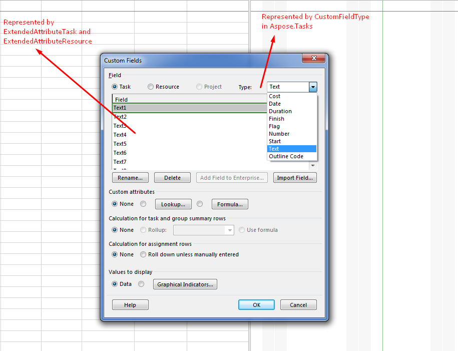

{} 

Microsoft Project (MSP) has an extensive XML data interchange schema that makes exchanging information between applications and programming with project files easier. The schema allows you to add extended attributes to tasks, resources and assignments. This article demonstrates how to work with Extended Attributes using Aspose.Tasks.

{} 
## **Working with Custom Fields using Microsoft Project**
In this example, we will demonstrate how to work with Text1 extended attribute of a project for associating the information with a Task.

1. In MSP, go to Project->Custom Fields.
2. From here, select Task.
3. Select Text as Custom Field Type from the Type combo box.
4. Select Text1 as a custom field that you want to work with
5. Use the "Rename" button to rename the alias of the field if it is desired and press OK button
6. Add a new task and insert a new column to the task row with the custom field that you used in the above step

## **Working with Custom Fields/Extended Attributes using Aspose.Tasks API**
Aspose.Tasks API provides the capability of creating new extended attributes as well as working with Extended attributes already present in a document. Custom fields or Extended Attributes are represented by ExtendedAttributes collection of a project in Aspose.Tasks. It contains all the extended attributes definition of a project document. Some of the mappings of MSP Custom Field definition are as shown in the image below.

### **Creating a New Extended Attribute and Adding it to Task**
To add a new extended attribute for task or resource, we first need to define and add the extended attribute definition to the ExtendedAttributes collection. ExtendedAttributeDefinition class is used to define a new ExtendedAttribute in a project. The FieldId must be set for proper defining an Extended attribute which is linked to ExtendedAttributeTask (in case of Task) or ExtendedAttributeResource (in case of Resource). The following sample code shows how to define a new Extended Attribute for Text1 field of project. Once the Extended Attribute definition is complete, you can now create a new Extended Attribute from it and assign it to a task.


## **Writing Updated Extended Attribute Definitions and Values to MPP**
Aspose.Tasks API supports updating extended attribute data in a Microsoft Project MPP file and save it back.

The code example given below demonstrates how to add new extended attributes of the Resource and Task types to the source MPP file. The steps involved in this activity are:

1. Create an instance of Project Reader.
2. Read the source MPP file.
3. Define a new extended attribute and update its values.
4. Save the project using the Project Writer.

The following example shows setting the extended attributes of a resource.


