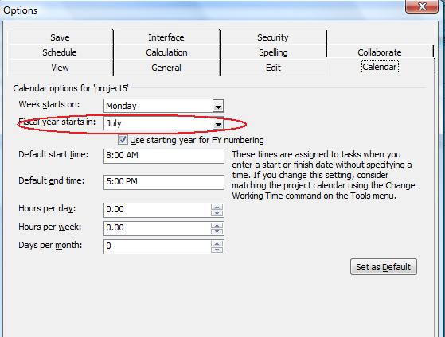
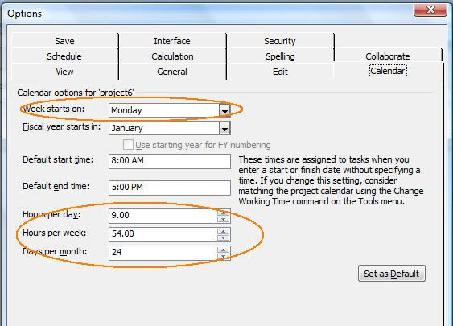

## **Fiscal Year Properties**
The fiscal year is the same as a financial year or budget year. It is the dates between which a country, an organization or an individual calculate budgets and taxes. Microsoft Project lets users define a fiscal year for projects. Aspose.Tasks for C++ supports this functionality with properties that allow developers to both read fiscal year properties from existing projects, and set fiscal year properties when creating or working with projects.

The [Prj](https://apireference.aspose.com/tasks/cpp/class/aspose.tasks.prj) class exposes the [FyStartDate](https://apireference.aspose.com/tasks/cpp/class/aspose.tasks.prj#af2248a2e6774eadc20587bded81a2da4) and [FiscalYearStart](https://apireference.aspose.com/tasks/cpp/class/aspose.tasks.prj#a39aa93f1bf7d9d8cd06a7b7490b21a56) properties used to manage fiscal year for a project:

- [FyStartDate](https://apireference.aspose.com/tasks/cpp/class/aspose.tasks.prj#af2248a2e6774eadc20587bded81a2da4): define the fiscal year start month and supports one of the values defined by the Month enumeration.
- [FiscalYearStart](https://apireference.aspose.com/tasks/cpp/class/aspose.tasks.prj#a39aa93f1bf7d9d8cd06a7b7490b21a56): determines whether the fiscal year numbering has been used in the project. Boolean.

### **Reading Fiscal Year Properties**
The FyStartDate and FiscalYearStart properties make it easy to find out what the current fiscal year start date is, and whether fiscal year numbering is used, with Aspose.Tasks.

The code example given below demonstrates how to read a project's fiscal year properties and displays them in a console window.



### **Writing Fiscal Year Properties**
To see fiscal year properties in Microsoft Project:

1. Open a project file.
2. On the **Tools** menu, click **Options**.
3. Click the **Calendar** tab. It will look like the one shown below.

Checking that the fiscal year properties have been set in Microsoft Project.

The code example given below demonstrates how to write the fiscal year properties of the project.



## **Weekday Properties**
Microsoft Project lets users set a number of different weekday properties. For example, what day a week starts on and how many working days are in a month. Aspose.Tasks for C++ support these features through a number of properties that can be used both to read weekday properties and to write them to a project.

Aspose.Tasks for C++ has a series of properties, exposed by the [Prj](https://apireference.aspose.com/tasks/cpp/class/aspose.tasks.prj) class, specifically for managing a project's weekday properties:

- [WeekStartDay](https://apireference.aspose.com/tasks/cpp/class/aspose.tasks.prj#aaf8561bf962c6861f3a38e2c0a8e1cc6): the first day of the week. This property takes values defined by the [DayType]() enumeration.
- [DaysPerMonth](https://apireference.aspose.com/tasks/cpp/class/aspose.tasks.prj#afc571efea974575fc65cc2a1d85cd5f5): the number of working days in a month, passed as an integer.
- [MinutesPerDay](https://apireference.aspose.com/tasks/cpp/class/aspose.tasks.prj#a7b20906f16b3239553ee2482b944b3fb): the number of working minutes in a working day, passed as an integer.
- [MinutesPerWeek](https://apireference.aspose.com/tasks/cpp/class/aspose.tasks.prj#ab5b9ef90f85682ea3060cdcb5a81116f): the number of working minutes in a working week, passed as an integer.

### **Reading Weekday Properties**
The code example given below demonstrates how to read a project's weekday properties and writes them to a console window.



### **Writing Weekday Properties**
To see weekday properties in Microsoft Project:

1. Open a file.
2. On the **Tools** menu, click **Options**.
3. Select the **Calendar** tab. It will look something like the example below.

**Viewing weekday properties in Microsoft Project**

The code example given below demonstrates how to write weekday properties, as shown in the screenshot above, to a project.


