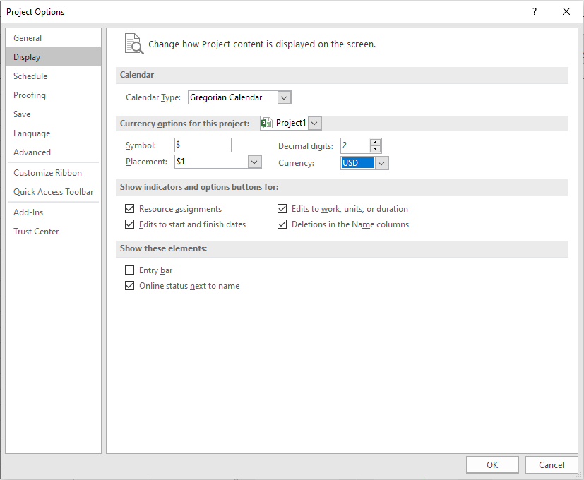

## **Overview**
Microsoft Project lets users set which currency costs are shown in, in a project. They can define set the currency code, numbers after the decimal point and currency symbol so that costs show in an easy to read and intuitive way. Aspose.Tasks supports these features and provides a series of properties that help developers set and control currency properties. This topic explains how to read currency properties, and how to set them.

Aspose.Tasks provides properties exposed by the [Project](https://apireference.aspose.com/tasks/cpp/class/aspose.tasks.project/) class, for managing currency properties:

- [CurrencyCode](): the three-letter currency code, for example, USD, GBP or AUD, passed as a string.
- [CurrencyDigits](): the number of numbers after the decimal point, for example, 2 (100.00) or 3 (100.000), passed as an integer.
- [CurrencySymbol](): the currency symbol, for example, $ or £, passed as a string.
- [CurrencySymbolPosition](): the position of the currency symbol, for example before ($100) or after (100$). CurrencySymbolPosition takes a value from the [CurrencySymbolPositionType]() enumeration.
### **Reading Currency Properties**
The code example given below demonstrates how to read a project's currency properties.


### **Writing Currency Properties**
To see the currency properties in Microsoft Project:

1. Open the project file.
2. On the **Tools** menu, select **Options**.
3. Click the **View** tab and for Project 2016 **Display**. It will look like the one shown below.

The code example given below demonstrates how to write currency properties to the project.


