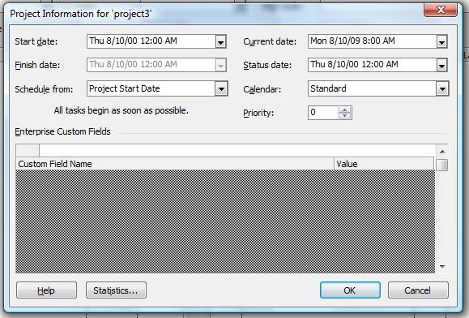

## **Working with General Project Properties**
Microsoft Project saves project properties, metadata, for every project. The properties include the project's start and end dates, the current date and the status date, the type of calendar used and when a project is scheduled from. Aspose.Tasks for C++ lets you read and set project properties as described below.

### **Reading Project Information**
The [Project](https://apireference.aspose.com/tasks/cpp/class/aspose.tasks.project) class has a number of properties that deal with project properties:

- [StartDate](https://apireference.aspose.com/tasks/cpp/class/aspose.tasks.prj#ac79e7a48ff250b7a15d967c16f46fce6): the project's start date, of the DateTime data type.
- [FinishDate](https://apireference.aspose.com/tasks/cpp/class/aspose.tasks.prj#ad17eb41147edf464fe3a926ceb1bf010): the project's end date, of the DateTime data type.
- [CurrentDate](https://apireference.aspose.com/tasks/cpp/class/aspose.tasks.prj#a6a85483dfc2fe9dfb5aa8977b706d9d8): the current date, of the DateTime data type.
- [StatusDate](https://apireference.aspose.com/tasks/cpp/class/aspose.tasks.prj#af7ddd2910722a858ae5b8b574505c67a): the date that the project's progress will be reported, of the DateTime data type.
- [ScheduleFromStart](https://apireference.aspose.com/tasks/cpp/class/aspose.tasks.prj#a9d4a036dd860de35317b4e0a3410e165): defines whether the project is scheduled from the start or end data and takes a Boolean value.
- [Calendar](https://apireference.aspose.com/tasks/cpp/class/aspose.tasks.prj#a3c3634148c9c3870bedabc5c43dca102): the type of calendar used by the project, managed through the [Aspose.Tasks.Calendar](https://apireference.aspose.com/tasks/cpp/class/aspose.tasks.calendar) class.

To read project properties in Microsoft Project, click **Project Information** on the **Project** menu.

The code example given below demonstrates how to read and output the project start and end date, whether the project is scheduled from the start or end, author, last author, revision, keywords and comments.



### **Writing Project Information**
Aspose.Tasks for C++ can write as well as read project information. The code example given below demonstrates how to set author, last author, revision, keywords and comments.



## **Determining Project Version**
Aspose.Tasks for C++ API provides the capability to retrieve project file information with simple API calls. The [Project](https://apireference.aspose.com/tasks/cpp/class/aspose.tasks.project) class's [Get](https://apireference.aspose.com/tasks/cpp/class/aspose.tasks.project#a52bb4058bfaffb6b9439320d25354444) method facilitates users to retrieve information using the static class [Prj](https://apireference.aspose.com/tasks/cpp/class/aspose.tasks.prj) that exposes a number of properties related to the Project class. This topic shows how to retrieve version information.

The SaveVersion and LastSaved properties exposed by the Prj class are used to determine the project version and the date when the project was last saved. SaveVersion supports the Integer datatype, whereas LastSaved supports the DateTime datatype.



## **Writing Project Summary Information**
Most programs save summary information with the files they save. Microsoft Project is no different. As well as the name of the author, the date the project was created and the last time it was edited and saved, it saves keywords, subject, comments and more. Aspose.Tasks for C++ lets you both read and write this type of information.

The Project's class Set method can be used to write and Get method can be used to read Project summary information using the Prj class's members. The file can be saved back after updating the summary information. To update the project summary information of an existing MPP file:

1. Create an instance of Project class
2. Set the various properties exposed by the Prj class to define summary information.
3. Save the Project using the Save method of Project class

To see the file's summary information:

1. Find the file in a file browser.
2. Right-click the file and select **Properties**.
3. Go to the **Details** tab.

The code example given below demonstrates how to write a project summary information to the MPP file.


