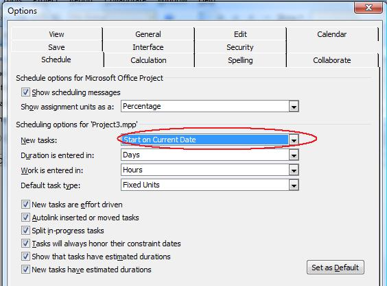

## **Setting Attributes for New Tasks**
Microsoft Project allows setting default properties for new tasks added. This topic explains how to set the default start date for new tasks using Aspose.Tasks for C++ API.

The [Project]() class exposes the [NewTaskStartDate]() property that defines the start date for a new task. This property supports the values defined by the [TaskStartDateType]() enumeration type.

To see the task attribute:

1. Open the file with Microsoft Project.
2. On the **Tools** menu, select **Options**.
3. Select the **Schedule** tab.
   The tab looks like the one shown below.

**New tasks set to start on the current date** 

The code example given below demonstrates how to set the new task start date.


