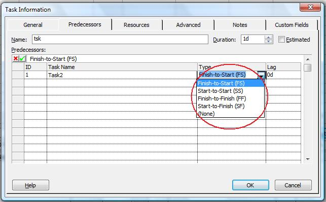

{} 

The LinkType property exposed by the TaskLink class is used to retrieve or define the type of link between two tasks. It reads and writes one of the values defined by the TaskLinkType enumeration type.

{}

## **Defining Link Type**
To define link type in Microsoft Project:
On the **View** menu, select **More Views** and then **Task Entry Form**.

1. Double-click the desired task.
2. Select the **Predecessor** tab.

**Defining link type in Microsoft Project** 

### **Setting Link Type with Aspose.Tasks**
The code sample given below set a link type as "Start-to-Start”, the default link type is "Finish-to-Start”.



### **Getting Link Type with Aspose.Tasks**
The code sample given below display link types by traversing the task links in the project and printing the result to a console window.


