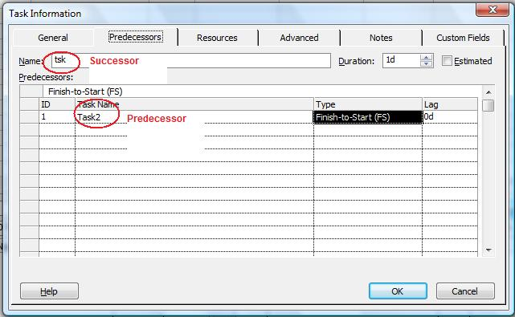

{}

The PredTask and SuccTask properties exposed by the [TaskLink](https://apireference.aspose.com/tasks/cpp/class/aspose.tasks.task_link) class are used to define the predecessor and successor tasks for a TaskLink. Both of these properties read and write a [Task](https://apireference.aspose.com/tasks/cpp/class/aspose.tasks.task) object.

{}

## **Working with Predecessor and Successor Tasks**
To manage predecessor tasks in Microsoft Project:

1. From the **View** menu, select **More Views** and then **Task Entry Form**.
2. Double-click the desired task.
3. Select the Predecessor tab.

**Viewing predecessor tasks in Microsoft Project** 

### **Getting Predecessor Tasks**
The code sample given below displays the predecessor and successor task after traversing the task links in the project and writing the results to a console window.


