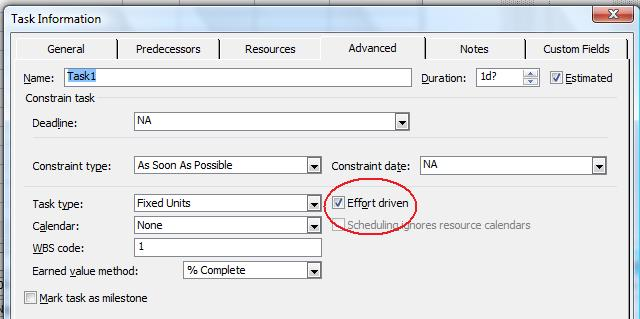

{}

Microsoft Project recognized a number of different types of tasks. Tasks with no duration, for example, are considered milestones by default. Critical tasks make up the critical path, one or a series of tasks that, ultimately, determines how long a project will take.

{}

## **Working with Critical and Effort-Driven Tasks**
The [Tsk](https://reference.aspose.com/tasks/net/aspose.tasks/tsk) class exposes the IsCritical and IsEffortDriven properties to handle critical and effort driven tasks:

- IsCritical sets or gets whether a task is critical (bool value).
- IsEffortDriven: sets or gets whether a task is effort-driven (bool value).

### **Critical and Effort-driven Tasks in Microsoft Project**
To check whether a task is critical or effort-driven in Microsoft Project double-click a task in the Task Entry form:

### **Getting Critical and Effort-Driven Tasks**
The following code examples demonstrate how to get information about whether a task is critical or effort-driven.


