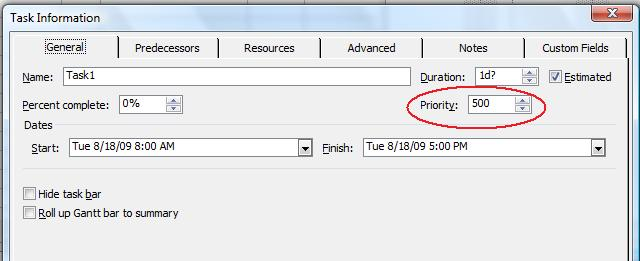

A task's priority helps Microsoft Project with automatic resource levelling (a process of fixing conflicts when a resource is over-allocated). In Microsoft Project, it is possible to assign priority values between 0 and 1000 (where 0 is the lowest priority). By default, tasks are assigned the value 500.

## **Working with Priorities**
The priorities associated with a class are handled through the Priority property exposed by the [Tsk](https://reference.aspose.com/tasks/net/aspose.tasks/tsk) class.

- Priority: a task's priority (an integer between 1 and 1000).

### **Priorities in Microsoft Project**
To check a task's priority in Microsoft Project one need to double-click a task in the Task Entry form:

**Task priority in Microsoft Project**

### **Getting a Task's Priority**
The code example given below demonstrates how to get a task's priority and write it to a console window using Aspose.Tasks.


