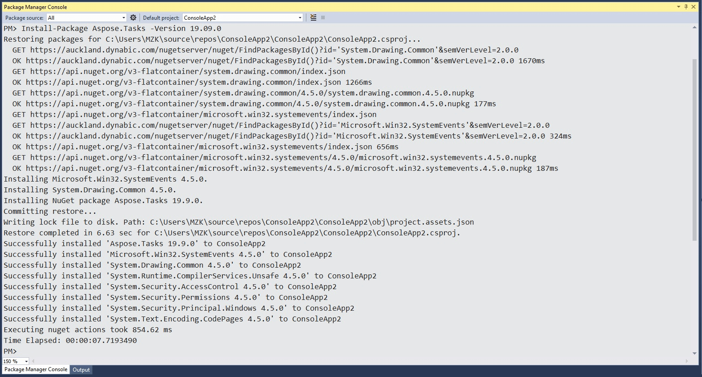

## **Installing Aspose.Tasks for C++**
### **Using NuGet Package Manager**
NuGet is the easiest way to download and install Aspose APIs. Open Microsoft Visual Studio and NuGet package manager. Search "aspose" to find the desired Aspose API. Click on "Install", the selected API will be downloaded and referenced in your project.

### **Install or Update using the Package Manager Console**
You can follow the steps below to reference the Aspose.Tasks API using the package manager console:

1. Open your solution/project in Visual Studio.
2. Select Tools -> Library Package Manager -> Package Manager Console from the menu to open package manager console.

Type the command "**Install-Package Aspose.Tasks.Cpp -Version 19.9.0**” and press enter to install the latest full release into your application. Alternatively, you can add the "**-prerelease**" suffix to the command in order to specify that the latest release including hotfixes is to be installed as well.

You should now find that Aspose.Tasks has successfully been added and referenced in your application for you.

### **Manual Installation**
You can download [Aspose.Tasks for C++](https://www.nuget.org/packages/Aspose.Tasks.Cpp/) from NuGet Gallery, by clicking the "Manual download" link in the Info Section or can be downloaded from <https://downloads.aspose.com/tasks/cpp>.

Please perform the following steps in order to use Aspose.Tasks for C++ in your applications:

1. [Download](https://www.nuget.org/packages/Aspose.Tasks.Cpp/) the latest files.
2. Unzip the folder to the production environment.
3. To use Aspose.Tasks for C++, reference Include and lib folders in your project.
## **Uninstalling Aspose.Tasks for C++**
If you installed Aspose.Tasks using the MSI installer, you can remove the component and the associated demos and documentation:

1. On the **Start** menu, select **Settings** and then **Control Panel**.
2. Click **Add/Remove Programs**.
3. Select **Aspose.Tasks**.
4. Click **Change/Remove** to remove Aspose.Tasks.
