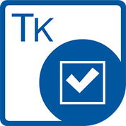

{}

Aspose.Tasks for C++ is a native class library that enables C++ applications to read and write MPP/XML files without using Microsoft Project software. The component provides an easy to use API for manipulating project files, saving time and money compared to developing similar features from scratch.

{}

## **Benefits**
Aspose.Tasks for C++ supports MPP, MPT, XML, XLSX, HTML, PDF and other formats. Using Aspose.Tasks you can generate, modify and convert documents without utilizing Microsoft Project software.

### **Rich Features**
Aspose.Tasks for C++ offers a wide arrange of features for creating, reading, manipulating and saving project files:

- Read, change and write Microsoft Project MPP/XML documents.
- Read MPP projects (native Microsoft Project format) and XML project formats. Microsoft Project 2003, 2007, 2010, 2013, 2016 and 2019 MPP formats are supported
- Create, update and write projects in XML project format.
- Read MPP project files, update their summary information and write them in original MPP format.
- Read MPP project files and convert them to XML format using Aspose.Tasks for C++ (the XML can be manipulated by implementing a custom XML parser).
- Change main project settings like schedule type, start and finish dates.
- Change default project settings like default standard rate, default overtime rate, default task type, default fixed cost accrual, etc.
- Manage extended attributes.
- Define weekdays for the project.
- Define weekdays for calendars and calendar exceptions.
- Read and write calendars for tasks and resources.
- Manage task baseline scheduling and duration.
- Handle constraints on tasks.
- Create and manage links between tasks.
- Read, change and create tasks, milestone, estimated critical or effort driven tasks.
- Manage resources costs and variances.
- Access assignment costs and budget.
- Support for the encoding of MPX files.
- Resource prefix implementation for nested resources.
- Support of setting CSS prefix for HTML export.
- Set custom date format while exporting to PDF format.
- Reading of [VBA information](/tasks/cpp/reading-vba-information-from-mpp-file/) (references, modules, module attributes) from MPP is supported.

### **Platform Independence**
Aspose.Tasks for C++ supports:
Windows:
- Visual Studio 2012
- Visual Studio 2015
- Visual Studio 2017
- Visual Studio 2019
Linux
- CLang3.9+, GCC6+
MacOS
- CLang13

### **Supported Microsoft Project Versions**
- 2003
- 2007
- 2010
- 2013
- 2016
- 2019
- 2021

## **Limitations**
- No support for printing of any kind
- No support for the database I/O access of any kind
- No support for EMF/WMF format, neither itself nor as Project file inclusions.

## **Technical Support**
Aspose provides unlimited free technical support for all its products. The support is available to all users, including ones running an evaluation. If you need help, [**visit the Aspose.Forums**](https://forum.aspose.com/c/tasks/15). Post your question in the Aspose.Tasks forum and it will be answered within a few hours.

When expecting a reply in the forums, please allow for time zone differences.
### **Reporting an Issue**
If you have an issue, follow these simple steps to make sure it is resolved efficiently:

- Make sure you use the latest version of the product before reporting an issue. 
- Have a look through the [forums](https://forum.aspose.com/c/tasks/15), this documentation Wiki and the [API Reference](https://reference.aspose.com/tasks/cpp) before reporting an issue. Your question may already have an answer.
- When reporting an issue, please include the original document and possibly a fragment of your code that causes the problem. If you need to attach multiple files, zip them into one. It is safe to attach your documents in the forums since only you and Aspose's developers have access to attached files.
- Please try to report one issue per thread. If you have another issue, report it in a separate thread.

Aspose does not provide technical support over the phone. Phone support is only available for sales and purchase questions.

## **Resources**
This table lists important Aspose.Tasks for C++ technical resources.

|**Resource**|**Description**|
| :- | :- |
|[Aspose.Tasks home page](https://products.aspose.com/tasks/cpp)|Product home page.|
|[Aspose.Tasks blog](https://blog.aspose.com/category/tasks/)|Check this often for information about new releases and useful tips about Aspose.Tasks.|
|[Aspose.Tasks for C++ support forum](https://forum.aspose.com/c/tasks/15)|Post your questions and issues here for a speedy resolution.|
|[Aspose.Tasks for C++ product documentation](/tasks/cpp/)|Full online documentation.|
|[Aspose.Tasks for C++ API References](https://reference.aspose.com/tasks/cpp)|Aspose.Tasks for C++ API Reference.|
