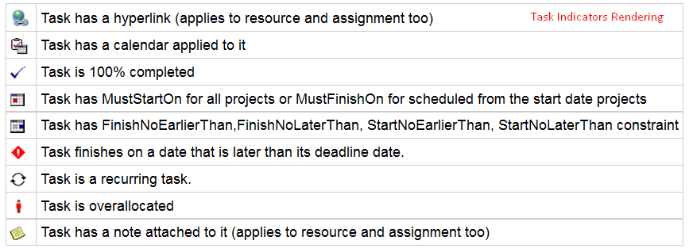
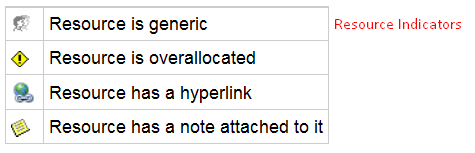
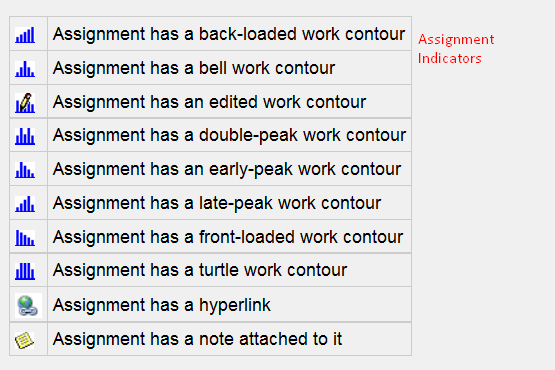

{} 

This article shows how to render project data to PDF using Aspose.Tasks for Java. The API provides the following capabilities while rendering project data to various output formats including PDF.

{} 
## **PDF Creator Information**
- Please note that you cannot set values against the **Application** and **Producer** fields, because of Aspose Ltd. and Aspose.Tasks for Java x.x.x will be displayed against these fields.
## **Saving a Project as a PDF**
The [Project](https://apireference.aspose.com/tasks/java/com.aspose.tasks/project) class exposes the Save method which is used to save a project in various formats. The Save method allows you to render project data to PDF using the SaveFileFormat enumeration type.

To save a project to PDF:

1. Load a Microsoft Project file.
2. Save the project to PDF using SaveFileFormat.PDF.

The following lines of code show how to achieve this.



### **Supported Graphical Column Indicators**
Aspose.Tasks draw graphical column indicators while rendering project data to PDF. The following are the graphical indicators supported by Aspose.Tasks.

|**Indicator Type**|**Graphical Representation**|
| :- | :- |
|Task Indicators||
|Resource Indicators||
|Assignment Indicators||

### **Saving to Multiple PDF Files**
To save the project data to multiple PDF files, set the SaveToSeparateFiles flag to true.



### **Customizing TextStyle for Project Data**
Aspose.Tasks allows you to customize the text style for overallocated resources. By default, the style for overallocated resources is similar to Microsoft Project (MSP), that is, it is red and bold. TextItemType.OverallocatedResources enables you to customize the color and style for overallocated resources. The example below shows how.



### **Customizing Date Format**
Aspose.Tasks give developers control over date formatting when rendering project data to output. The following example shows how to use the DateFormat enumerator to specify the date format.

**Java**



 Project project = new Project();
 Date date = new Date();
 project.setStartDate(date);
 
 // By default project.DateFormat == DateFormat.Date_ddd_mm_dd_yy (Mon 09/22/14)
 // customize DateFormat (September 22, 2014)
 project.setDateFormat(DateFormat.Date_mmmm_dd_yyyy);
 
 project.save("saved.pdf", SaveFileFormat.PDF);
 
 //Export to date format 19/07/2016
 project.setDateFormat(DateFormat.DateDdMmYyyy);
 
 project.save("p2.pdf", SaveFileFormat.PDF);

