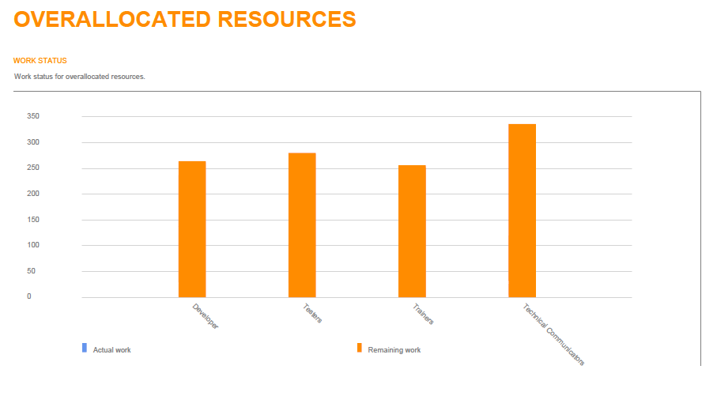

{} 

Aspose.Tasks provides reporting services for creating reports from project files similar to Microsoft Project. The SaveReport function is used to create PDF files containing the report's images. This function takes two arguments:

1. the PDF file name. and
1. the ReportType enumerator.

{} 
## **Aspose.Tasks Reporting Services**
### **Types of Report**
The following types of reports can be created using Aspose.Tasks:

1. [Project overview](/tasks/java/reporting-services/)
1. [Resource cost overview](/tasks/java/reporting-services/)
1. [Cost overview](/tasks/java/reporting-services/)
1. [Work overview](/tasks/java/reporting-services/)
1. [Critical tasks](/tasks/java/reporting-services/)
1. [Milestones](/tasks/java/reporting-services/)
1. [Late tasks](/tasks/java/reporting-services/)
1. [Resource overview](/tasks/java/reporting-services/)
1. [Cost overruns](/tasks/java/reporting-services/)
1. [Upcoming task](/tasks/java/reporting-services/)
1. [Task cost overview](/tasks/java/reporting-services/)
1. [Over-allocated resources](/tasks/java/reporting-services/)
1. [Slipping tasks](/tasks/java/reporting-services/)
1. [Best practice analyzer](/tasks/java/reporting-services/)
1. [Burn down](/tasks/java/reporting-services/)
1. [Cash flow](/tasks/java/reporting-services/)

The sample code snippets below can be used to create these reports. All the sample MPP files used in these examples are present as attachments for testing the sample code.
#### **Project Overview**

**Java**



 //Project OverView

Project project3 = new Project("Cyclic stucture.mpp");

project3.saveReport("ProjectOverView.pdf", ReportType.ProjectOverview);


#### **Resource Cost Overview**

**Java**



 //Resource Cost Overview

Project project4 = new Project("OzBuild 16 Orig.mpp");

project4.saveReport("ResourceCostOverview.pdf", ReportType.ResourceCostOverview);


#### **Cost Overview**

**Java**



 //Cost Overview

Project project5 = new Project("OzBuild 16 Orig.mpp");

project5.saveReport("CostOverview.pdf", ReportType.CostOverview);


#### **Work Overview**

**Java**



 //Work Overview

Project project6 = new Project("Residential Construction.mpp");

project6.saveReport("WorkOverview.pdf", ReportType.WorkOverview);


#### **Critical Tasks**

**C#**



 //Critical Tasks

Project project7 = new Project("Residential Construction.mpp");

project7.saveReport("CriticalTasks.pdf", ReportType.CriticalTasks);


#### **Milestones**

**C#**



 //Milestones

Project project8 = new Project("Residential Construction.mpp");

project8.saveReport("Milestones.pdf", ReportType.Milestones);


#### **Late Tasks**

**C#**



 //Late Tasks

Project project9 = new Project("Residential Construction.mpp");

project9.saveReport("LateTasks.pdf", ReportType.LateTasks);


#### **Resource Overview**

**C#**



 //Resource Overview

Project project10 = new Project("Software Development Plan.mpp");

project10.saveReport("ResourceOverview.pdf", ReportType.ResourceOverview);


#### **Cost Overruns**

**C#**



 //Cost Overruns

Project project11 = new Project("Software Development.mpp");

project11.saveReport("CostOverruns.pdf", ReportType.CostOverruns);


#### **Upcoming Task**

**C#**



 //Upcoming Task

Project project12 = new Project("UpcomingTasks.mpp");

project12.saveReport("UpcomingTasks.pdf", ReportType.UpcomingTask);


#### **Task Cost Overview**

**C#**



 //Task Cost Overview

Project project13 = new Project("Software Development.mpp");

project13.saveReport("TaskCostOverview.pdf", ReportType.TaskCostOverview);


#### **Over-allocated Resources**

**C#**



 //Over allocated Resources

Project project14 = new Project("Software Development Plan.mpp");

project14.saveReport("OverAllocatedResources.pdf", ReportType.OverallocatedResources);


#### **Slipping Tasks**

**C#**



 //Slipping Tasks

Project project15 = new Project("Cyclic stucture.mpp");

project15.saveReport("SlippingTasks.pdf", ReportType.SlippingTasks);


#### **Best Practice Analyzer**

**C#**



 //Best Practice Analyzer

Project project16 = new Project("Cyclic stucture.mpp");

project16.saveReport("BestPracticeAnalyzer.pdf", ReportType.BestPracticeAnalyzer);


#### **Burn Down**

**C#**



 //Burn down

Project project17 = new Project("Cyclic stucture.mpp");

project17.saveReport("Burndown.pdf", ReportType.Burndown);


#### **Cash Flow**

**C#**



 //Cash Flow

Project project18 = new Project("OzBuild 16 Orig.mpp");

project18.saveReport("CashFlow.pdf", ReportType.CashFlow);


