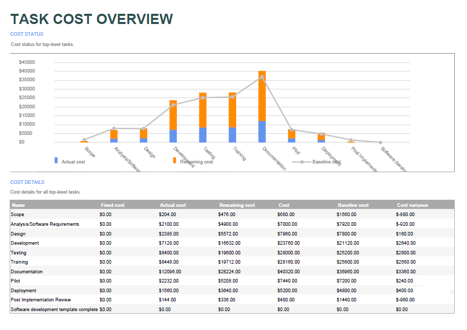

{} 

Aspose.Tasks provides reporting services for creating reports from project files similar to Microsoft Project. The SaveReport function is used to create PDF files containing the report's images. This function takes two arguments:

1. the PDF file name. and
2. the ReportType enumerator.

{}

## **Aspose.Tasks Reporting Services**
### **Types of Report**
The following types of reports can be created using Aspose.Tasks:

1. [Project overview](/tasks/java/reporting-services/)
2. [Resource cost overview](/tasks/java/reporting-services/)
3. [Cost overview](/tasks/java/reporting-services/)
4. [Work overview](/tasks/java/reporting-services/)
5. [Critical tasks](/tasks/java/reporting-services/)
6. [Milestones](/tasks/java/reporting-services/)
7. [Late tasks](/tasks/java/reporting-services/)
8. [Resource overview](/tasks/java/reporting-services/)
9. [Cost overruns](/tasks/java/reporting-services/)
10. [Upcoming task](/tasks/java/reporting-services/)
11. [Task cost overview](/tasks/java/reporting-services/)
12. [Over-allocated resources](/tasks/java/reporting-services/)
13. [Slipping tasks](/tasks/java/reporting-services/)
14. [Best practice analyzer](/tasks/java/reporting-services/)
15. [Burn down](/tasks/java/reporting-services/)
16. [Cash flow](/tasks/java/reporting-services/)

The sample code snippets below can be used to create these reports. All the sample MPP files used in these examples are present as attachments for testing the sample code.
#### **Project Overview**

**Java**


Project project = new Project("Cyclic structure.mpp");
project.saveReport("ProjectOverView.pdf", ReportType.ProjectOverview);


#### **Resource Cost Overview**

**Java**


Project project = new Project("OzBuild 16 Orig.mpp");
project.saveReport("ResourceCostOverview.pdf", ReportType.ResourceCostOverview);


#### **Cost Overview**

**Java**


Project project = new Project("OzBuild 16 Orig.mpp");
project.saveReport("CostOverview.pdf", ReportType.CostOverview);


#### **Work Overview**

**Java**


Project project = new Project("Residential Construction.mpp");
project.saveReport("WorkOverview.pdf", ReportType.WorkOverview);


#### **Critical Tasks**

**Java**


Project project = new Project("Residential Construction.mpp");
project.saveReport("CriticalTasks.pdf", ReportType.CriticalTasks);


#### **Milestones**

**Java**


Project project = new Project("Residential Construction.mpp");
project.saveReport("Milestones.pdf", ReportType.Milestones);


#### **Late Tasks**

**Java**


Project project = new Project("Residential Construction.mpp");
project.saveReport("LateTasks.pdf", ReportType.LateTasks);


#### **Resource Overview**

**Java**


Project project = new Project("Software Development Plan.mpp");
project.saveReport("ResourceOverview.pdf", ReportType.ResourceOverview);


#### **Cost Overruns**

**Java**


Project project = new Project("Software Development.mpp");
project.saveReport("CostOverruns.pdf", ReportType.CostOverruns);


#### **Upcoming Task**

**Java**


Project project = new Project("UpcomingTasks.mpp");
project.saveReport("UpcomingTasks.pdf", ReportType.UpcomingTask);


#### **Task Cost Overview**

**Java**


Project project = new Project("Software Development.mpp");
project.saveReport("TaskCostOverview.pdf", ReportType.TaskCostOverview);


#### **Over-allocated Resources**

**Java**


Project project = new Project("Software Development Plan.mpp");
project.saveReport("OverAllocatedResources.pdf", ReportType.OverallocatedResources);


#### **Slipping Tasks**

**Java**


Project project = new Project("Cyclic structure.mpp");
project.saveReport("SlippingTasks.pdf", ReportType.SlippingTasks);


#### **Best Practice Analyzer**

**Java**


Project project = new Project("Cyclic structure.mpp");
project.saveReport("BestPracticeAnalyzer.pdf", ReportType.BestPracticeAnalyzer);


#### **Burn Down**

**Java**


Project project = new Project("Cyclic structure.mpp");
project.saveReport("Burndown.pdf", ReportType.Burndown);


#### **Cash Flow**

**Java**


Project project = new Project("OzBuild 16 Orig.mpp");
project.saveReport("CashFlow.pdf", ReportType.CashFlow);

