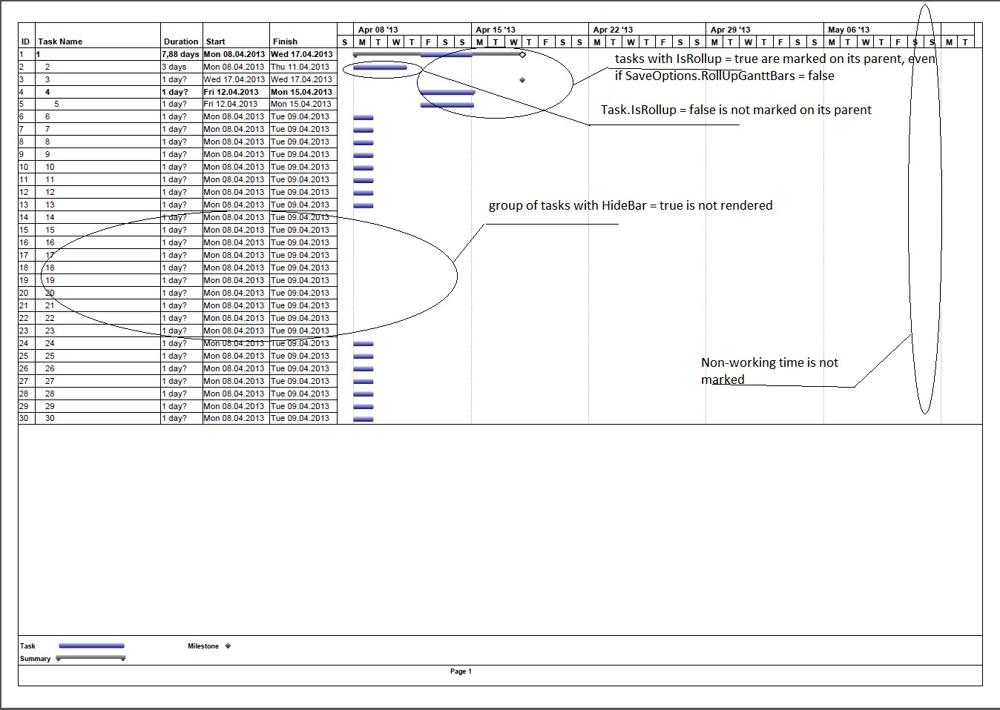

{} 

Microsoft Project lets users set the timescale that a Gantt chart is displayed in. (The timescale is indicated at the top of the Gantt chart view.) They can have up to three tiers of timescale to give them exactly the time resolution they need.

Aspose.Tasks supports this feature and lets you render Gantt charts with different timescale settings. Gantt charts can be rendered to one page image using these options.

{} 
## **Setting Timescales and Saving to an Image**
The ImageSaveOptions class' Timescale property determines a project's timescale settings. The timescale is set to Days by default. The other options are Month and Third of Months.

The following code sample:

1. Reads a project file.
1. Sets each different timescale setting.
1. Saves the file to disk as a JPG.

**Java**



 Project project = new Project("NewProductDev.mpp");

// Save to one page image (Timescale.days by default)

project.save("NewProductDevDays.jpeg", new ImageSaveOptions(SaveFileFormat.JPEG));

// Save to one page image (Timescale.ThirdsOfMonths)

ImageSaveOptions options = new ImageSaveOptions(SaveFileFormat.JPEG);

options.setTimescale(Timescale.ThirdsOfMonths);

project.save("NewProductDevThirdsOfMonths.jpeg", options);

// Save to one page image (Timescale.Months)

options.setTimescale(Timescale.Months);

project.save("NewProductDevMonths.jpeg", options);



## **Rolling Up Gantt Bars During Rendering**
If the SaveOptions.RollUpGanttBars property is set to true, any summary task in the project is marked by its visible subtasks, keeping into account the Task.HideBar property when rendering. (If Task.HideBar = true, the bar is not rendered on the Gantt chart.) If SaveOptions.RollUpGanttBars = false, the subtask will be shown on the summary task anyway, provided that subtask.IsRollup and subtask.ParentTask.IsRollup are set to true. Also, if SaveOptions.DrawNonWorkingTime (default value = true) is set to false, non-working time will not be shown on the Gantt chart.
### **Example 1**
**C#**



 PdfSaveOptions options = new PdfSaveOptions();

options.PresentationFormat = PresentationFormat.GanttChart;

options.FitContent = true;

options.RollUpGanttBars = false;

options.DrawNonWorkingTime = false;

options.PageSize = PageSize.A3;

string file = Path.Combine(Common.TestdataPath + "Rendering\\", fileName);

string resFile = Path.Combine(resultFolder, fileName.Replace(".mpp", ".pdf"));

Project project = new Project(file); // We can read a project without the ProjectReader now.

project.Save(resFile, options);



**Output from example 1** 

### **Example 2**
In this example, SaveOptions.RollUpGanttBars = true, SaveOptions.DrawNonWorkingTime = true, and task.HideBar = false for hidden tasks.

**Java**



 PdfSaveOptions options = new PdfSaveOptions();

options.setPresentationFormat(PresentationFormat.GanttChart);

options.setFitContent(true);

options.setRollUpGanttBars(false);

options.setDrawNonWorkingTime(false);

options.setPageSize(PageSize.A3);

Project project = new Project("RollUpGanttBars.Mpp"); // We can read a project without the ProjectReader now.

project.save("RollUpGanttBars.pdf", options);



**Output from example 2** 

## **Customizing Text with Task Bars**
In this example, the text on the right of the task bar can be customized by delegate instance. Here we customize text on the critical tasks.

**Java**



 long OneSec = 10000000;//microsecond * 10

long OneMin = 60 * OneSec;

long OneHour = 60 * OneMin;

Project project = new Project();

Task task1 = project.addTask("Task 1");

Task task2 = project.addTask("Task 2");

double dDuration = OneHour * 8.0 * 3.0;	//3 days taks

task1.setDuration((long) dDuration);

task1.setDuration((long) dDuration);

TaskLink link = new TaskLink(task1, task2, TaskLinkType.FinishToStart);

project.addTaskLink(link);

Task task3 = project.addTask("Task 3");

Resource rsc1 = project.addResource("Resource 1");

Resource rsc2 = project.addResource("Resource 2");

Resource rsc3 = project.addResource("Resource 3");

project.addResourceAssignment(task1, rsc1);

project.addResourceAssignment(task2, rsc2);

project.addResourceAssignment(task3, rsc3);

SaveOptions options = new PdfSaveOptions();

options.setTimescale(Timescale.ThirdsOfMonths);

BarStyle style = new BarStyle();

style.setItemType(BarItemType.CriticalTask);

style.setBarTextConverter(new BarStyle.TaskToBarTextConverter() {

    @Override

    public String invoke(Task task) {

        return "task " + task.getName() + "is on critical path";

    }

} );

BarStyle style2 = new BarStyle();

style2.setBarColor(Color.darkGray);

style2.setItemType(BarItemType.Task);

options.setBarStyles(new ArrayList<BarStyle>());

options.getBarStyles().add(style);

options.getBarStyles().add(style2);

project.save("result2.pdf", options);


## **Align Cell Contents**
Text can be aligned by the GanttChartColumn.StringAlignment, ResourceViewColumn.StringAlignment properties. Alignment by default is StringAlignment.Near (left).

**Java**



 Project project = new Project("RenderMe.mpp"); // attached test project

SaveOptions options = new PdfSaveOptions();

options.setTimescale(Timescale.Months);

options.setView(ProjectView.getDefaultGanttChartView());

GanttChartColumn col = (GanttChartColumn) options.getView().getColumns().get(2);// as GanttChartColumn;

col.setStringAlignment(1);	//center

col = (GanttChartColumn) options.getView().getColumns().get(3);

col.setStringAlignment(2);	//far

col = (GanttChartColumn) options.getView().getColumns().get(4);

col.setStringAlignment(2);	//far

project.save("result GanttChart.pdf", options);

options.setPresentationFormat(PresentationFormat.ResourceSheet);

ResourceViewColumn col1 = (ResourceViewColumn) options.getView().getColumns().get(2);

col1.setStringAlignment(1);

col1 = (ResourceViewColumn) options.getView().getColumns().get(3);

col1.setStringAlignment(2);

col1 = (ResourceViewColumn) options.getView().getColumns().get(4);

col1.setStringAlignment(2);

project.save("result ResourceSheet.pdf", options);


## **Changing Gantt Chart Bars Color Gradient**
Microsoft Project allows users to render the output of Gantt charts using gradient colors. The same functionality is provided by Aspose.Tasks as shown in the following sample code.

**Java**



 Project project = new Project("NewProductDev.mpp");

SaveOptions options = new XamlOptions();

options.setUseGradientBrush(false);

project.save("solid.xaml", options);

options.setUseGradientBrush(true);

project.save("gradient.xaml", options);


## **Setting Start date of Gantt Chart View**
The TimeScaleStart property exposed by Prj class allows to set the start date of Gantt chart view. However, if the saved file is opened by MSP in maximized window mode then the timescale start date will not match.

**Java**



 Project project = new Project("REL_Constr.mpp");

project.set(Prj.TIMESCALE_START, new Date(115, 2, 3));

project.Save("temp.mpp", SaveFileFormat.MPP);


