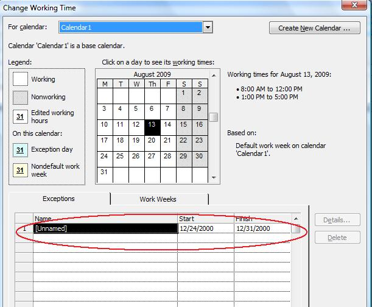

{} 

When setting up calendar exceptions with Aspose.Tasks, it is possible to define days as exceptions.

{} 
**Defining Workdays**
The [Exceptions](https://apireference.aspose.com/tasks/java/com.aspose.tasks/CalendarExceptionCollection) collection exposed by the [Calendar](https://apireference.aspose.com/tasks/java/com.aspose.tasks/Calendar) class can be used to define the weekdays for an exception.

To see a list of exceptions in Microsoft Project:

1. Open a file.
2. From the **Tools** menu, select **Change Working Time** to open the Change Working Time dialog.
   The screenshot below shows the dialog for the project saved with the code below.

**Exceptions defined for working days** 

**Programming Sample**

The following example defines the dates 24-Dec-2009 through 31-Dec-2009 as exceptions.


