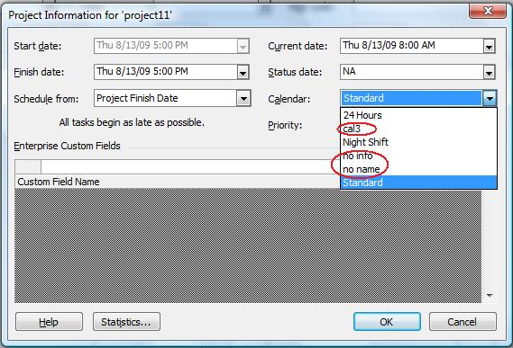
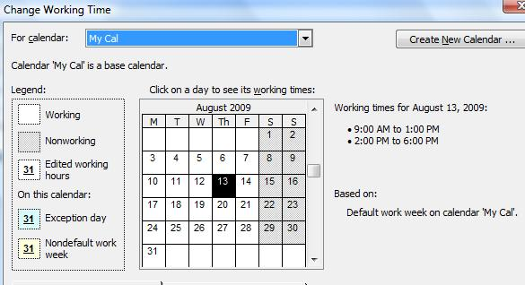

## **Creating Calendars**
Calendars and other information is used by Microsoft Project to build project schedules. With Aspose.Tasks, adding a calendar to a project is easy. The Calendar class constructors allow you to assign a calendar name to the calendar. The options are described below.

There are three ways of creating a calendar in Aspose.Tasks. The [Calendar](https://apireference.aspose.com/tasks/java/com.aspose.tasks/Calendar) class exposes the following constructor:

- Calendar(string name) – Creates a calendar with a name.

Project calendars are returned as CalendarCollection by the getCalendars() method of Project class. When you open the output file in Microsoft Project and, on the **Project** menu, select **Project Information** to access the calendars. 

## **Project information showing the calendars info**

## **Programming Sample**


## **Defining Weekdays for Calendar**
Microsoft Project keeps track of which days are considered weekdays in a calendar so that it can calculate project end dates and so on. Aspose.Tasks allows developers to define weekdays for a calendar associated with a project. This topic shows how.

The Days collection exposed by the [Calendar](https://apireference.aspose.com/tasks/java/com.aspose.tasks/Calendar) class is used to define the weekdays for a calendar. The Days collection represents an array list of [WeekDay](https://apireference.aspose.com/tasks/java/com.aspose.tasks/WeekDay) objects.

The CreateDefaultWorkingDay method exposed by the WeekDay class can further be implemented to define the default day timings, while the FromTime and ToTime properties exposed by the WorkingTime class is used to define the specific timing for a day. The FromTime and ToTime support the DateTime datatype.

The code samples below set weekdays for a project. After running the code, open the output file in Microsoft Project and, on the **Tools** menu, select **Change Work Timing** to establish that the changes have been applied. 

**Defining weekdays in Microsoft Project** 

**Programming Sample**

The code below defines Monday through Thursday as weekdays with default timings, whereas Friday as a weekday with special timings.


## **Replacing a Calendar**
Calendars are used to see whether resources are available, and when tasks are scheduled. There are different types of calendars. This topic looks at how to replace a base calendar, that is, the calendar used for projects and tasks, with another one.

Base calendars come in different forms:

- Standard: the default calendar has a Monday to Friday work week and a day that runs from 08:00 to 17:00.
- 24-hours: used for around the clock working, or for resources that run around the clock.
- Night shift: similar to the standard calendar, the night-shift calendar has a Monday to Saturday morning work week and a day that runs from 23:00 to 08:00.

### **Replacing a Calendar with a New Calendar**
The [Project](https://apireference.aspose.com/tasks/java/com.aspose.tasks/Project) class contains CalendarCollection that comprises of all the calendars which are part of the project. A Calendar item can be removed and a new can be added as well, thus replacing the older one.

**Programming Sample**

The following lines of code replace an existing calendar with a new standard calendar.



## **Making a Standard Calendar**
A standard calendar provides the most common work days, work hours and holidays. By default, a standard calendar is added whenever a project is created using Microsoft Project. Aspose.Tasks has features for defining a standard calendar for a project.

The [Calendar](https://apireference.aspose.com/tasks/java/com.aspose.tasks/Calendar) class exposes the following two static (shared in Visual Basic) overloaded methods for creating a standard calendar:

- makeStandardCalendar() – Creates a new standard calendar.
- makeStandardCalendar(Calendar cal) – Makes a calendar as standard.

In Microsoft Project, open the file output by the code below and, on the **Tools** menu, select **Change Working Times Information**, to see the standard calendar. 

**The Change Working Times Information dialog shows the standard calendar used by the project** 

**Programming Sample**

The following lines of code create a standard calendar using both methods.



## **Writing Updated Calendar Data to MPP**
With Aspose.Tasks, you can update calendar data in a Microsoft Project MPP file and save it back. This topic shows an example of adding a calendar to the MPP file, update it and save back the changes to the MPP file.

The following code shows how to update the calendar data of a project by adding a new calendar and saving it back to the original MPP file. The steps involved in this activity are:

1. Create an instance of the Project class.
2. Read the source MPP file using the constructor.
3. Add the calendar data to the project.
4. Save the updated project data back to the MPP file.

**Programming Sample**

