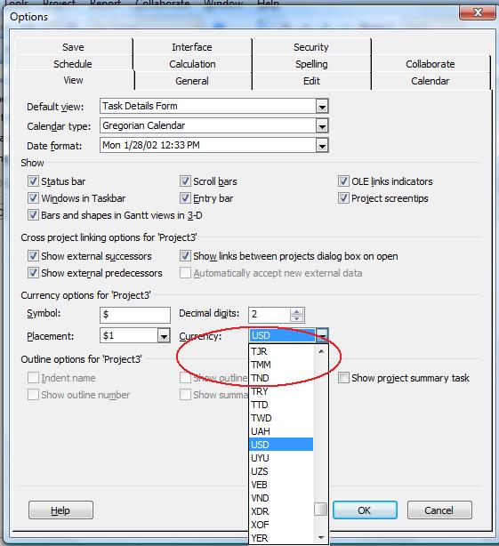

## **Managing Currency Codes**
The CurrencyCode property exposed by the [Project](https://apireference.aspose.com/tasks/java/com.aspose.tasks/project)
class is used to set or get the three-letter currency code for a project. This property supports the string data type.

To see a project's currency code in Microsoft Project:

1. On the **Tools** menu, select **Options**.
2. Select the **View** tab

**Currency codes in Microsoft Project**

### **Setting Currency using Aspose.Tasks**
The following example shows how to set these properties.


Project prj = new Project();
prj.set(Prj.CURRENCY_CODE, "USD");


### **Getting Currency Code using Aspose.Tasks**
These properties can be accessed using the project's CurrencyCode property.


