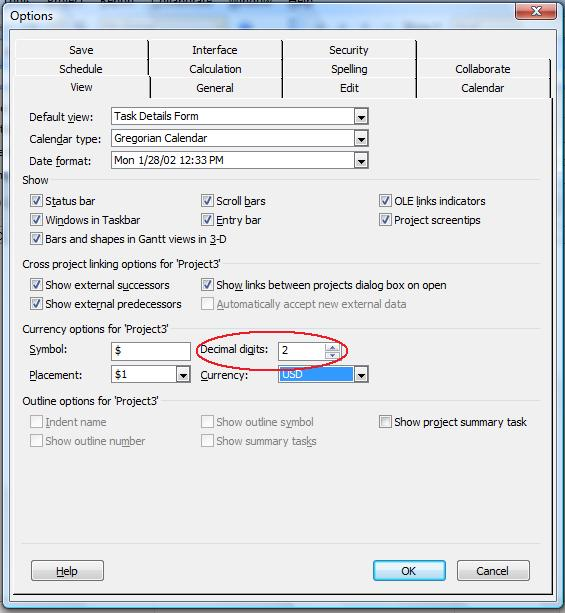

{} 

Currency digits set the number of decimal points (digits after a decimal point) used for currency.

{} 
## **Managing Currency Digits**
The CurrencyDigits property exposed by the [Project](https://apireference.aspose.com/tasks/java/com.aspose.tasks/project) class is used to set or get the number of digits after the decimal symbol for a project's currency. This property supports the integer data type.

To view the currency digit for a project in Microsoft Project:

1. Form the **Tools** menu, select **Options**.
2. Select the **View** tab.

**Currency digits in Microsoft Project** 

### **Setting Currency Digits using Aspose.Tasks**
The following example shows how to set currency digits with Aspose.Tasks.



### **Getting Currency Digits using Aspose.Tasks**
The currency properties are accessed through the project's CurrencyDigits property.


