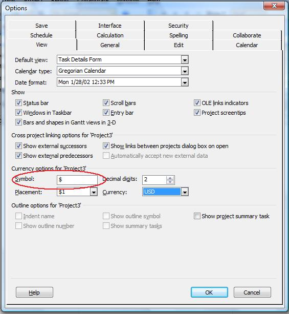

## **Managing Currency Symbols**
The CurrencySymbol property exposed by the [Project](https://apireference.aspose.com/tasks/java/com.aspose.tasks/project) class is used to set or get the currency symbol. This property supports the string data type.

To see a project's currency symbol in Microsoft Project:

1. From the **Tools** menu, select **Options**.
2. Select the **View** tab.

**Viewing the currency symbol in Microsoft Project**

### **Setting Currency Symbol using Aspose.Tasks**
The following example shows how to set a currency symbol for a project.



### **Getting Currency Symbol using Aspose.Tasks**
Access the currency symbol using a project's CurrencySymbol:


