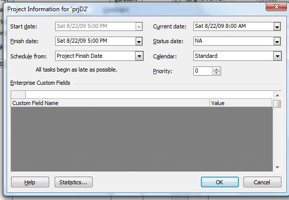

{} 

Aspose.Tasks for Java lets you work with Microsoft Project files without having Microsoft Project installed, or using Microsoft Office Automation. A powerful and flexible API, Aspose.Tasks saves you time and effort by giving you the tools you need to write efficient code for manipulating project files.

Aspose.Tasks can open existing files, but it can also create new files. This article explains how to create a new and empty project file from a stream or using the [Project](https://apireference.aspose.com/tasks/java/com.aspose.tasks/project) class.

{} 
## **Creating an Empty Project File**
The [Project](https://apireference.aspose.com/tasks/java/com.aspose.tasks/project) class is the main class in Aspose.Tasks used to set and get properties associated with a project, as well as behavior. The save method offered by this class makes it possible to render the Project to various output formats such as XML, MPP, PDF, HTML, etc. with a single API call. This method accepts a file stream or file name, and one of the values provided by the SaveFileFormat enumeration type.

At present, Aspose.Tasks provides the facility to create XML project files only. The following lines of code create a simple project file in XML format.

The XML project file can be opened in Microsoft Project:

1. ON the **File** menu, select **Open**.
2. Select the XML format (*.xml) option from the file types and browse to the output XML file.
3. On the **Project** menu, select **Project Information**.

**The project information for the output XML file** 

### **Create an Empty Project Using File Stream**
The given below code example shows how to create an empty project using file stream with Aspose.Tasks. 



## **Reading a Project File**
Aspose.Tasks lets you open existing files and manipulate them as well as creating new files. This topic shows how a Project file can be read using the Project class's constructor.

The [Project](https://apireference.aspose.com/tasks/java/com.aspose.tasks/project) class constructor accepts a valid FileInputStream object or path to MPP or XML document and returns a [Project](https://apireference.aspose.com/tasks/java/com.aspose.tasks/project) object which can be used to manipulate project data.


### **Reading Project Files as a Template**
**Java**



 //Read a project from a template
 Project project = new Project("d:\\Project1.mpp");

### **Reading Project Data from Microsoft Project Database**
Aspose.Tasks API now allows to read Project data from the Microsoft Project database. The SqlConnectionStringBuilder and MspDbSettings classes can be used to accomplish this purpose providing connection string settings for connection to the database.





### **Reading Project Data from Microsoft Access Database (MPD)**

### **Ignoring invalid characters during loading Project**
Some files may have invalid characters in the custom fields. Microsoft Project does not allow invalid character so the files have been created or manipulated with automation or some other tools.
If these be loaded using the API, they may lead to an exception. In order to ignore such invalid characters, the overloaded constructor of the Project class can be used with the delegate method ParseErrorCallBack.


## **Read Password Protected Projects (2003 Format)**
` `This topic shows how to read password protected projects in 2003 format using Aspose.Tasks for Java.

The [Project](https://apireference.aspose.com/tasks/java/com.aspose.tasks/project) class exposes the Project() constructor which is capable of reading password protected files in 2003 format. Saving a password-protected file is not supported yet.

To read a password-protected project file:

1. Load a Microsoft Project file.
2. In the constructor, provide a password as the second argument to the constructor.

The following lines of code show how to achieve this using Java.



The following code example demonstrates how to check if the project file is password protected.



## **Reading Project Online**
The [ProjectServerManager](https://apireference.aspose.com/tasks/java/com.aspose.tasks/ProjectServerManager) class provides the methods to retrieve projects from the specified Project Online account. The ProjectServerCredentials class shall be used to provide credentials that are used to connect to Project Online. Previously,  Microsoft.SharePoint.Client.Runtime assembly was used to retrieve AuthToken but now Aspose.Tasks provides an option to specify SiteUrl, username, and password to create a connection to Project Online.  

The following lines of code show how to read the project online.


