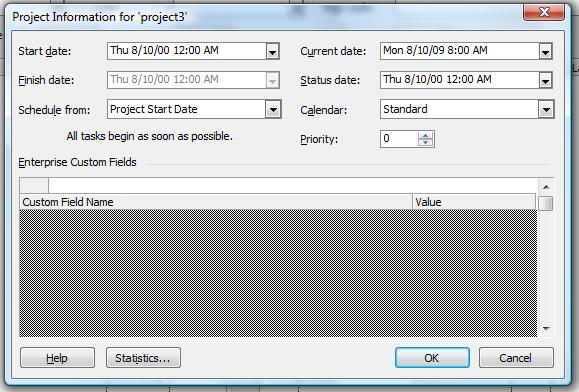
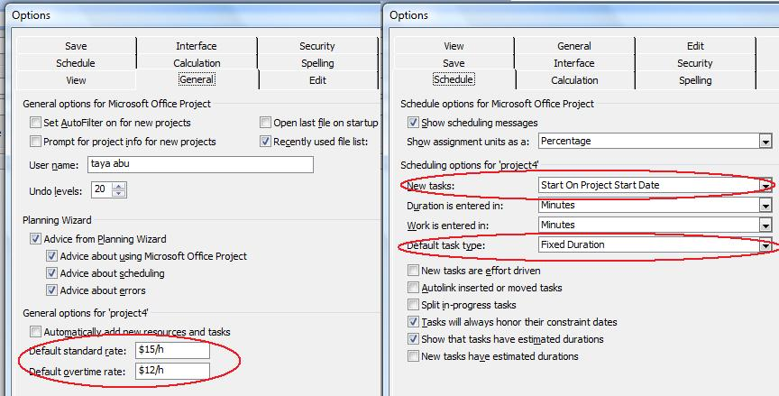
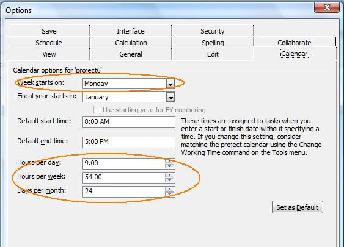
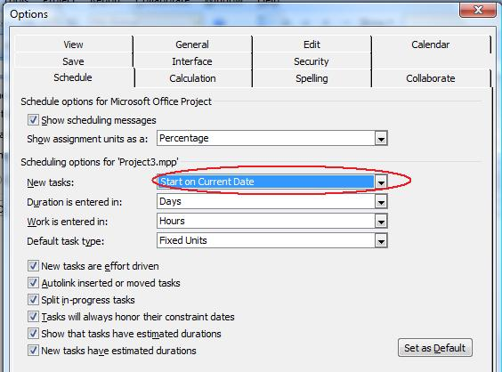

## **Working with General Project Properties**
Microsoft Project saves project properties, metadata, for every project. The properties include the project's start and end dates, the current date and the status date, the type of calendar used and when a project is scheduled from. Aspose.Tasks for Java lets you read and set project properties. This topic shows how.

{}

Please note that you cannot set values against the **Application** and **Producer** fields, because Aspose Ltd. and Aspose.Tasks for Java x.x.x will be displayed against these fields

{}

### **Reading Project Information**
The Prj class has a number of properties that deal with project properties:

- START_DATE: the project's start date, of the Date data type.
- FINISH_DATE: the project's end date, of the Date data type.
- CURRENT_DATE: the current date, of the Date data type.
- STATUS_DATE: the date that the project's progress will be reported, of the Date data type.
- SCHEDULE_FROM_START: defines whether the project is scheduled from the start or end data and takes a Boolean value.
- CALENDAR: the type of calendar used by the project, managed through the [Calendar](https://apireference.aspose.com/tasks/java/com.aspose.tasks/Calendar) class.

To read project properties in Microsoft Project, click **Project Information** on the **Project** menu.

## **Reading project properties in Microsoft Project**

The programming samples below show how to read and output the project start and end date, whether the project is scheduled from the start or end, the current date, status date, and the calendar type.



### **Writing Project Information**
Aspose.Tasks for Java can write as well as [read project information](/tasks/java/working-with-project-properties/). The code samples below show how to set the scheduling start point, the start date, current date, status date, and calendar type.



## **Determining Project Version**
Aspose.Tasks for Java lets you retrieve project file information such as the version of Microsoft Project that the file was created with. The Project class exposes the get() method for getting this information using the static [Project](https://apireference.aspose.com/tasks/java/com.aspose.tasks/project) class.

The SAVE_VERSION and LAST_SAVED properties exposed by the [Project](https://apireference.aspose.com/tasks/java/com.aspose.tasks/project) class is used to determine the project version and the date when the project was last saved.



## **Default Project Properties**
Microsoft Project lets users set default project properties that speed up the process of setting up a project. The default properties define when a new task starts and finishes, sets the default overtime and standard pay rates and more. Aspose.Tasks for Java supports these features. This article explains both how to read default properties and how to write default properties to a project file.

The Prj class exposes a number of properties for managing a project's default properties:

- DEFAULT_START_TIME: a new tasks' default start time, takes a Date value.
- DEFAULT_FINISH_TIME: a new tasks' default finishing time, takes a Date value.
- DEFAULT_FIXED_COST_ACCRUAL: an assignment's default fixed cost accrual, takes one of the values defined by the CostAccrualType enumeration.
- DEFAULT_STANDARD_RATE: the default standard pay rate, takes a double.
- DEFAULT_OVERTIME_RATE: the default overtime pay rate, takes a double.
- DEFAULT_TASK_EV_METHOD: the default task earned value method, takes one of the values defined by the EarnedValueMethodType enumeration.
- DEFAULT_TASK_TYPE: the project's default task type, takes one of the values defined by the TaskType enumeration.

To see the default project information in Microsoft Project:

1. Open a project.
2. On the **Tools** menu, click **Options**.
3. Go to the **General** tab.
   Here, you can see the settings for the default standard and overtime rates.
4. Go to the **Schedule** tab.
   Here, you can see the settings for the default task type and default task start time.

## **Default project information in Microsoft Project, as written by Aspose.Tasks**

### **Reading Default Properties**
The following example reads a project's default properties and writes them to a console window.



### **Writing Default Properties**
The following lines of code set a project's default properties.



## **Writing Project Summary Information**
Most programs save summary information with the files they save. Microsoft Project is no different. As well as the name of the author, the date the project was created and the last time it was edited and saved, it saves keywords, subject, comments and more. Aspose.Tasks for Java lets you both read and write this type of information. This topic explains how to open a project file, set the summary information and save it again.

The [Prj](https://apireference.aspose.com/tasks/java/com.aspose.tasks/prj) class exposes a number of properties to set or get summary information about an MPP project file. Aspose.Tasks for Java can update the project summary information and then write the project file back to MPP. To update the project summary information of an existing MPP file:

1. Create an instance of the Project class to read the input MPP file
2. Set the various properties exposed by the [Project](https://apireference.aspose.com/tasks/java/com.aspose.tasks/project) object to define summary information.
3. Save the [Project](https://apireference.aspose.com/tasks/java/com.aspose.tasks/project) using the Save method of [Project](https://apireference.aspose.com/tasks/java/com.aspose.tasks/project) class

To see the a file's summary information:

1. Find the file in a file browser.
2. Right-click the file and select **Properties**.
3. Go to the **Details** tab.



## **Fiscal Year Properties**
The fiscal year is the same as a financial year or budget year. It is the dates between which a country, an organization or an individual calculates budgets and taxes. Microsoft Project lets users define a fiscal year for projects. Aspose.Tasks for Java supports this functionality with properties that allow developers to both read fiscal year properties from existing projects, and set fiscal year properties when creating or working with projects.

The Prj class exposes the FY_START_DATE and FISCAL_YEAR_START properties to manage fiscal year for a project:

- FY_START_DATE: define the fiscal year start month and supports one of the values defined by the Month enumeration.
- FISCAL_YEAR_START: determines whether the fiscal year numbering has been used in the project. nullable boolean

### **Reading Fiscal Year Properties**
The FY_START_DATE and FISCAL_YEAR_START properties make it easy to find out what the current fiscal year start date is, and whether fiscal year numbering is used, with Aspose.Tasks.

The following code reads a project's fiscal year properties and displays them in a console window.



## **Weekday Properties**
Microsoft Project lets users set a number of different weekday properties, for example, what day a week starts on and how many working days are in a month. Aspose.Tasks support these features through a number of properties that can be used both to read weekday properties and to write them to a project.

Aspose.Tasks has a series of properties, exposed by the [Prj](https://apireference.aspose.com/tasks/java/com.aspose.tasks/prj) class, specifically for managing a project's weekday properties:

- WEEK_START_DAY: the first day of the week. This property takes values defined by the DayType enumeration.
- DAYS_PER_MONTH: the number of working days in a month, passed as an integer.
- MINUTES_PER_DAY: the number of working minutes in a working day, passed as an integer.
- MINUTES_PER_WEEK: the number of working minutes in a working week, passed as an integer.

### **Reading Weekday Properties**
The following code reads a project's weekday properties and writes them to a console window.



### **Writing Weekday Properties**
To see weekday properties in Microsoft Project:

1. Open a file.
2. On the **Tools** menu, click **Options**.
3. Select the **Calendar** tab. It will look something like the example below.

## **Viewing weekday properties in Microsoft Project**

The following code writes weekday properties, as shown in the screenshot above, to a project.



## **Currency Properties**
Microsoft Project lets users set which currency costs are shown in, in a project. They can define set the currency code, numbers after the decimal point and currency symbol so that costs show in an easy to read and intuitive way. Aspose.Tasks for Java supports these features and provides a series of properties that help developers set and control currency properties. This article explains both how to read currency properties, and how to set them.

Aspose.Tasks for Java provides properties, exposed by the Prj class, for managing currency properties:

- CURRENCY: the three-letter currency code, for example USD, GBP or AUD, passed as a string.
- CURRENCY_DIGITS: the number of numbers after the decimal point, for example 2 (100.00) or 3 (100.000), passed as an integer.
- CURRENCY_SYMBOL: the currency symbol, for example $ or £, passed as a string.
- CURRENCY_SYMBOL_POSITION: the position of the currency symbol, for example before ($100) or after (100$). CurrencySymbolPosition takes a value from the CurrencySymbolPositionType enumeration.

### **Reading Currency Properties**
The following piece of code reads a project's currency properties.



### **Writing Currency Properties**
The above sample code will create the project file.

To see the currency properties in Microsoft Project:

1. Open the project file.
2. On the **Tools** menu, select **Options**.
3. Click the **View** tab. It will look like the one shown below.

## **Reading currency properties in Microsoft Project**

The following example writes currency properties to the project.



## **Setting Attributes for New Tasks**
Microsoft Project allows to set default properties for new tasks added. This article explains how to set the default start date for new tasks using Aspose.Tasks for Java API.

The static class [Prj](https://apireference.aspose.com/tasks/java/com.aspose.tasks/prj) exposes the NEW_TASK_START_DATE method that defines the start date for a new task. This property supports the values defined by the TaskStartDateType enumeration type.

To see the task attribute:

1. Open the file with Microsoft Project.
2. On the **Tools** menu, select **Options**.
3. Select the **Schedule** tab.
   The tab looks like the one shown below.

**New tasks set to start on the current date** 

The following lines of code sets the new task start date.


