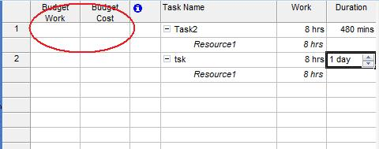

## **Managing Assignment Budget**
The [ResourceAssignment](https://apireference.aspose.com/tasks/java/com.aspose.tasks/resourceassignment) class exposes a number of properties for working with an assignment's budget:

- BudgetCost represents the budgeted cost of resources assignments (decimal).
- BudgetWork represents the budgeted work of resource assignments to date.

To see assignment budgets in Microsoft Project:

1. On the Task Usage page, select the Insert menu and then Column.
2. Add columns.

**Budget columns added in Microsoft Project** 

### **Getting Assignment Budget with Aspose.Tasks**
The following example shows how to get an assignment budget using Aspose.Tasks.


