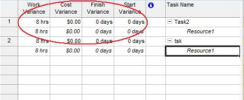

## **Managing Variances**
The [ResourceAssignment](https://apireference.aspose.com/tasks/java/com.aspose.tasks/ResourceAssignment) class exposes several properties for handling variance in an assignment's baseline values and the actual cost, start date, finish data and work:

- CostVariance handles the variance in cost against an assignment's baseline (double).
- StartVariance handles the variance in start date against an assignments baseline (integer).
- FinishVariance handles the variance in end date against an assignments baseline (integer).
- WorkVariance handles the variance in work against an assignment's baseline (double).

To see resource assignment variances in Microsoft Project:

1. On the Task Usage screen, select **Insert** and ten **Columns**.
2. Add the desired columns.

**Variance columns added in Microsoft Project** 

### **Getting Assignment Variance in Aspose.Tasks**
The following example shows how to get the resource work variance using Aspose.Tasks.


