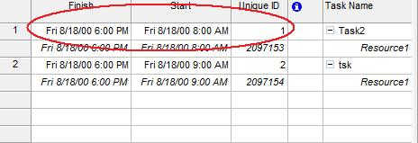

{} 

An assignment is a resource that has been assigned to a specific task. Each resource has general properties, typically a unique ID, a start and a finish time. This article explains how to set and get these properties with Aspose.Tasks.

{} 
## **Working with General Assignment Properties**
The [ResourceAssignment](https://apireference.aspose.com/tasks/java/com.aspose.tasks/ResourceAssignment) class exposes a number of properties used to set and get general assignment properties:

- Uid sets and gets an assingment's unique ID (integer).
- Start sets and gets an assignment's start date (java.util.Date).
- Finish sets and gets an assignment's end date (java.util.Date).

To see an assignment's general properties in Microsoft Project:
From the **View** menu, select **Task Usage**.
From the **Insert** menu, select **Column**.
Add the Start. Finish and Unique ID columns.

**General assignment properties viewed in Microsoft Project** 

### **Setting General Resource Assignment Properties using Aspose.Tasks**
The following example shows how to set these properties from scratch.


### **Getting General Resource Assignment Properties using Aspose.Tasks**


