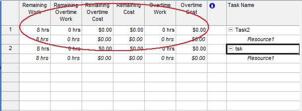

## **Handling Overtime, Remaining Costs and Work**
The [ResourceAssignment](https://apireference.aspose.com/tasks/java/com.aspose.tasks/ResourceAssignment) class exposes a number of properties for handling an assignment's overtime, remaining costs and work:

- OvertimeCost represents the sum of the actual and remaining overtime costs of an assignment (decimal).
- OvertimeWork represents the scheduled overtime work for an assignment (TimeSpan).
- RemainingCost represents the remaining projected cost for completing an assignment (decimal).
- RemainingOvertimeCost represents the remaining projected overtime cost for completing an assignment (decimal).
- RemainingWork represents the scheduled remaining work for an assignment (TimeSpan).
- RemainingOvertimeWork represents the scheduled remaining overtime work for an assignment (TimeSpan).

To see assignment overtime, remaining cost and work in Microsoft Project:

1. On the Task Usage screen, select the **Insert** menu, then **Column**.
2. Add the desired columns.

**Overtime, remaining costs and work columns added in Microsoft Project** 

### **Getting Assignment Overtimes in Aspose.Tasks**
The following example shows how to get assignment overtimes, remaining costs and work using Aspose.Tasks.


