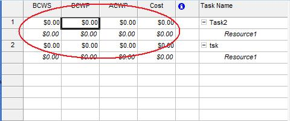

## **Managing Assignment Cost**
The [ResourceAssignment](https://apireference.aspose.com/tasks/java/com.aspose.tasks/ResourceAssignment) class exposes several properties used to manage assignment cost:

- Cost represents an assignment's total project cost (decimal).
- Bcwp represents the budgeted cost of work to date on an assignment (double).
- Bcws represents the budgeted cost of work scheduled for an assignment (double).
- Acwp represents the actual cost of the work carried out on an assignment to date (double).

To view assignment costs in Microsoft Project:

1. On the Task Usage page, select the **Insert** menu and then **Column**.
2. Add columns.

**Resource cost columns in Microsoft Project** 

### **Getting Assignment Costs with Aspose.Tasks**
The following example shows getting task costs using Aspose.Tasks.


