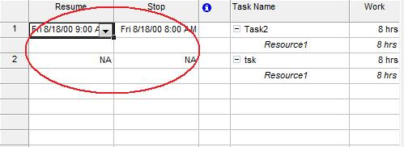

## **Stop or Resume an Assignment**
The [ResourceAssignment](https://apireference.aspose.com/tasks/java/com.aspose.tasks/ResourceAssignment) class exposes properties for reading and writing an assignment's stop and resume date:

- Stop reads or writes an assignment's stop date (Date).
- Resume reads or writes an assignment's resume date (Date).

To see an assignment's stop and resume dates in Microsoft Project:

1. On the Task Usage screen, select **Insert** and then **Column**.
2. Add the desired columns.

**Assignment stop and resume dates in Microsoft Project** 

### **Getting an Assignment's Stop and Resume Dates using Aspose.Tasks**
If an assignment hasn't been stopped, the stop and resume dates have the value NA. In the evaluation version of Aspose.Tasks, values equal to NA gets the value "1/1/2000". In the licensed version, NA values equal DateTime.MinValue.

In the following example, an assignment's stop and resume dates are displayed in a console window after the code's traversed the assignments in the project.


