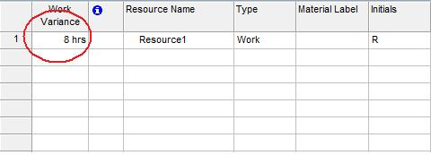

A work variance is the difference between the estimated work (the baseline) and actual work performed.

## **Handling Variances**
The WorkVariance property exposed by the [Resource](https://apireference.aspose.com/tasks/java/com.aspose.tasks/Resource) class handles variance in work:

- WorkVariance: a project resource's difference from the baseline work (double).

### **Microsoft Project View of Resource Work Variance**
To see the resource work variance in Microsoft Project:

1. On the Resource Sheet, go to the **Insert** menu and select **Column**.
2. Add the Variance column.

**Variance in Microsoft Project**

### **Getting Resource Work Variance in Aspose.Tasks**
The following examples show how to get resource work variance using Aspose.Tasks.


