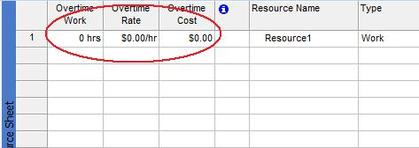

{} 

The [Calendar](https://apireference.aspose.com/tasks/java/com.aspose.tasks/Calendar) class exposes a number of properties for managing resource overtime:

- Overtime represents the overtime rate (decimal).
- OvertimeRate represents the overtime rate from the current date, if a rate table exists for the resource (decimal).
- OvertimeRateFormat represents the units used for the overtime rate (RateFormatType).
- OvertimeCost represents the sum of an actual and remaining overtime cost (decimal).
- OvertimeWork represents the amount of overtime work scheduled for a task

{} 
## **Working with Resource Overtimes**
To see overtime cost, overtime rate and overtime work in Microsoft Project:

1. On the Resource sheet, select the **Insert** menu and then select **Column**.
1. Add the columns. 
   **Overtime columns added to the Resource sheet in Microsoft Project** 

### **Getting Resource Overtimes in Aspose.Tasks**
The following example shows how to get resource overtimes using Aspose.Tasks.


