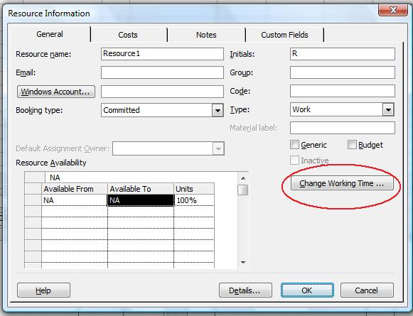

{} 

The [Resource](https://apireference.aspose.com/tasks/java/com.aspose.tasks/Resource) class exposes the Calendar property which is used to set or get the calendar for a resource. This property accepts and returns an [Calendar](https://apireference.aspose.com/tasks/java/com.aspose.tasks/Calendar) object.

{} 
## **Working with Resource Calendars**
To define a calendar for a resource in Microsoft Project:

1. In the Resource Sheet, double-click the desired resource.
1. Click the **Change Working Time** button.

**Changing working times in Microsoft Project** 

### **Setting Resource Calendar using Aspose.Tasks**
The following code creates a standard calendar and resource and then assigns the calendar to the resource.


### **Getting Resource Calendar using Aspose.Tasks**
The code below shows how to set resource calendars by traversing a project's resources.


