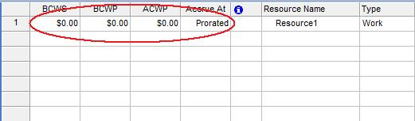

{} 

The [Resource](https://apireference.aspose.com/tasks/java/com.aspose.tasks/Resource) class is used to manage costs related to a resource:

- Cost represents a resource's total project cost across all assignments (decimal).
- BCWP represents the budgeted cost of work performed by a resource (double).
- BCWS represents the budgeted cost of scheduled work (double).
- ACWP represents the actual cost of work performed by a resource to date (double).
- AccrueAt represents the cost accrual method used for a resource (CostAccrualType).

{} 
## **Working with Resource Costs**
To view resource costs in Microsoft Project:

1. On the Resource sheet, from the **Insert** menu, select **Column**.
2. Add the columns.

**Cost columns added to the Resource sheet in Microsoft Project** 

### **Getting Resource Costs in Aspose.Tasks**
The following example shows how to get task costs using Aspose.Tasks.


