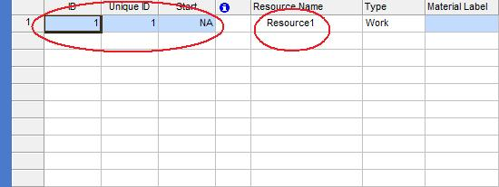

{}

The [Resource](https://apireference.aspose.com/tasks/java/com.aspose.tasks/Resource) class has a number of properties for getting and setting resource attributes:

- Name gets and sets a resource's name (string).
- Id gets and sets a resource's ID (integer).
- Uid gets and sets a resource's UID (integer).
- Start gets and sets a resource's start date (java.util.Date).
- Finish gets and sets a resource's end date (java.util.Date).

{}

## **Working with General Resource Properties**
To view a resource's general properties in Microsoft Project:

1. From the **View** menu, select **More Views** and then **Resource Sheet**.
2. From the **Insert** menu, select **Column**.
3. Add the Start, Finish, ID and unique ID columns.

**General resource properties in Microsoft Project**

### **Setting General Resource Properties using Aspose.Tasks**
The following example gives a detailed code sample about setting resource properties.


