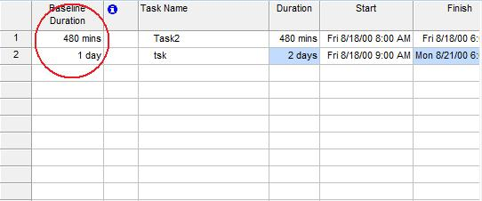

## **Task Baseline Duration**
The Duration and EstimatedDuration properties of the [TaskBaseLine](https://apireference.aspose.com/tasks/java/com.aspose.tasks/TaskBaseLine) class can be used to read and write the scheduled duration when the baseline was saved and determine whether the scheduled duration was estimated or not respectively.

- Duration supports the TimeSpan data type.
- EstimatedDuration supports the Boolean data type.

After saving a baseline, the task baseline duration can be viewed in Microsoft Project:

1. On the **View** menu, select **More Views** and ten **Task Entry**.
2. From the **Insert** menu, select **Columns**.
3. Add the Baseline Duration column.

**Task baseline duration in Microsoft Project**

### **Getting Task Baseline Duration using Aspose.Tasks**
The code below displays the task baseline duration in the console window after traversing the task baselines of a task.


