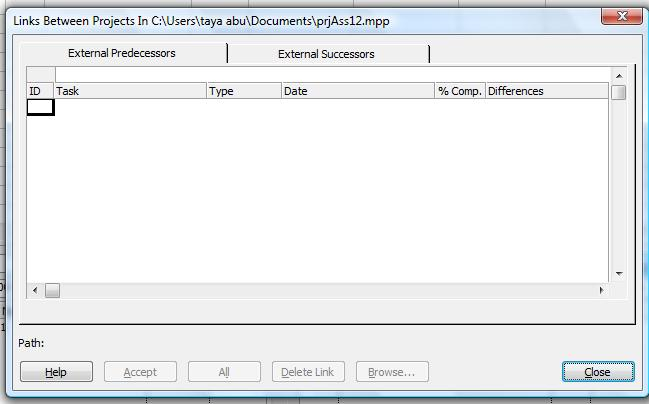

Microsoft Project lets users link tasks within the current project, or to external projects. Cross-project predecessors are predecessors from another project. Aspose.Tasks support these too.

## **Working with Cross-Project Predecessor Tasks**
In Aspose.Tasks for C++ the CrossProjectName and IsCrossProject properties exposed by the [TaskLink](https://apireference.aspose.com/tasks/java/com.aspose.tasks/TaskLink) class are used to handle cross-project predecessors.

- CrossProjectName represents the external predecessor project (string).
- IsCrossProject determines whether a predecessor is part of another project (Boolean).

To manage cross-project predecessor tasks in Microsoft Project from the **Tools** menu, select **Links between Projects**.

**Cross-project predecessors in Microsoft Project**

### **Getting Cross-Project Predecessor Tasks using Aspose.Tasks**
Here, we shall display predecessor and successor task traversing the task links in the project.


