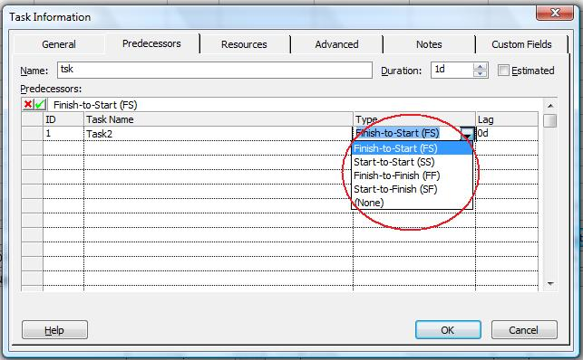

{} 

The LinkType property exposed by the [TaskLink](https://apireference.aspose.com/tasks/java/com.aspose.tasks/TaskLink) class is used to retrieve or define the type of link between two tasks. It reads and writes one of the values defined by the TaskLinkType enumeration type.

{} 
## **Defining Link Type**
To define link type in Microsoft Project:

1. On the **View** menu, select **More Views** and then **Task Entry Form**.
2. Double-click the desired task.
3. Select the **Predecessor** tab.

**Defining link type in Microsoft Project** 

### **Setting Link Type with Aspose.Tasks**
The code samples below set a link type as "Finish-to-Start”, the default link type.


### **Getting Link Type with Aspose.Tasks**

