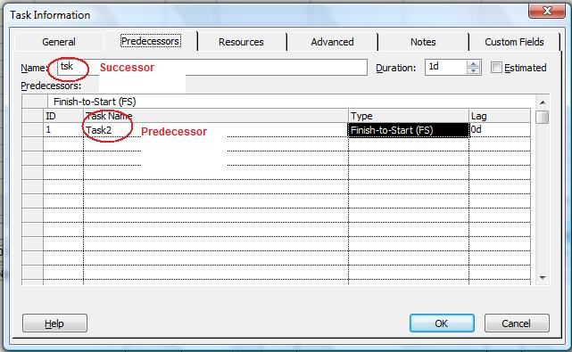

{} 

The PredTask and SuccTask properties exposed by the [TaskLink](http://www.aspose.com/api/java/tasks/com.aspose.tasks/classes/TaskLink) class are used to define the predecessor and successor tasks for a TaskLink. Both of these properties read and write [Task](http://www.aspose.com/api/java/tasks/com.aspose.tasks/classes/Task) object.

{} 
## **Working with Predecessor and Successor Tasks**
To manage predecessor tasks in Microsoft Project:

1. From the **View** menu, select **More Views** and then **Task Entry Form**.
1. Double-click the desired task.# Select the Predecessor tab.

**Viewing predecessor tasks in Microsoft Project** 

### **Getting Predecessor Tasks with Aspose.Tasks**
The code sample below displays the predecessor and successor task after traversing the task links in the project and writing the results to a console window.


