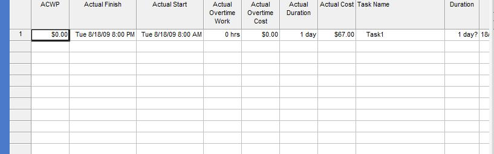

{} 

The actual properties are used to find out how much time or money has been sent on a task to date.

{} 
## **Working with Actual Properties**
The [Task](/pages/createpage.action?spaceKey=tasksjava&title=com.aspose.tasks.Task+Class&linkCreation=true&fromPageId=16581036) exposes a number of properties for determining a task's actual properties:

- ActualCost: a task's actual cost (double).
- ActualOvertimeCost: a task's actual overtime cost (double).
- ActualOvertimeWork: the actual overtime worked on a task.
- ActualDuration: a task's actual duration (TimeSpan).
- ActualStart: the date and time that a task actually started (Date).
- ActualFinish: the date and time that a task actually finished (Date).
- Acwp: the actual cost of the work performed on a task (double).

The ChildTasksCollector class collects all the child tasks from a given RootTask when used by TaskUtils.
### **Actual Properties in Microsoft Project**
To access these properties in Microsoft Project:

1. On the **View** menu, select **More Views** and then **Task Entry**.
1. On the **Insert** menu, select **Column** and add the desired columns to the Task Entry form. 

   **Actual properties in a Microsoft Project file** 

### **Getting Actual Properties with Aspose.Tasks**
A tasks actual properties can be obtained by traversing the tasks in a project. The code samples below writes the actual properties for all tasks found in a project to a console window.


