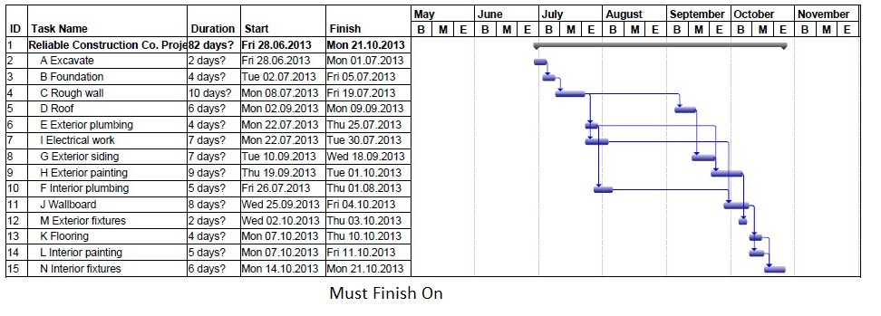

{} 

Task constraints are used to define a Microsoft Project project's schedule and define when tasks should be started or finished. Constraints can be flexible - start or end as soon as possible or as late as possible - or inflexible. Inflexible constraints are tied to specific dates.

{} 
## **Working with Constraints**
The ConstraintDate and ConstraintType properties are exposed by the [Task](http://www.aspose.com/api/java/tasks/com.aspose.tasks/classes/Task) class to handle constraints:

- ConstraintDate accepts and returns the Date data type.
- ConstraintType accepts and returns one of the values of the ConstraintType enumeration.
### **Setting Constraints in Microsoft Project**
To set constraints in Microsoft Project:

1. On the **View** menu, select **More Views** and then **Task Entry Form**.
1. Double click a task on the Task Entry Form.
1. Select the Advance tab.
1. Set a constraint by selecting an option from the **Constraint type** list and a date for the **Constraint date** list. 

   **Setting constraints in Microsoft Project** 

### **Setting Constraints with Aspose.Tasks**
The constraint date is NA when the constraint type is **As Soon As Possible** or **As Late As Possible**. For date values equal to NA, Aspose.Tasks uses the value “1/1/2000” in the evaluation version, and DateTime.MinValue for the licensed product. In the below case, we take a source project file as an input and apply different types of constraints on various tasks in each case. The following code samples show the application of different Constraint types and the accompanied snapshot of the result for each case.

**The input file** 

The code samples below set the constraint type set to Start No Earlier Than.

**Java**



 Project project = new Project("D:\\Sample.mpp");

SaveOptions saveOptions = new PdfSaveOptions();

saveOptions.setStartDate(project.getStartDate());

saveOptions.setTimescale(Timescale.ThirdsOfMonths);

Task summary = project.getTaskById(1);

summary.setConstraintType(ConstraintType.StartNoEarlierThan);

java.util.Calendar cal = java.util.Calendar.getInstance();

cal.set(2013, 6, 3, 9, 0, 0);

summary.setConstraintDate(cal.getTime());

Task.recalculate(project.getRootTask());

project.save("D:\\Sample.pdf", saveOptions);



**Output file with Start No Earlier Than constraint** 

The code samples below set the constraint type set to Finish No Earlier Than.

**Java**



 Project project = new Project("D:\\Sample.mpp");

Task first = project.getTaskById(2);

first.setConstraintType(ConstraintType.FinishNoEarlierThan);

java.util.Calendar cal = java.util.Calendar.getInstance();

cal.set(2013, 6, 1, 18, 0, 0);

first.setConstraintDate(cal.getTime());

Task.recalculate(project.getRootTask());

SaveOptions saveOptions = new PdfSaveOptions();

saveOptions.setStartDate(project.getStartDate());

saveOptions.setTimescale(Timescale.ThirdsOfMonths);

project.save("first FNET July 1.pdf", saveOptions);



**Output file showing Finish No Earlier Than contraint** 

The code samples below set the constraint type set to Must Start On.



 Task roof = project.getTaskById(5);

cal.set(2013, 8, 2, 9, 0, 0);

roof.setConstraintDate(cal.getTime());

roof.setConstraintType(ConstraintType.MustStartOn);

Task.recalculate(project.getRootTask());

project.save("roof MSO 2 Sep.pdf", saveOptions);



**Output file showing Must Start On constraint** 

The code samples below set the constraint type set to As Late As Possible.



 Task wallBoard = project.getTaskById(11);

wallBoard.setConstraintType(ConstraintType.AsLateAsPossible);

Task.recalculate(project.getRootTask());

project.save("wallboard alap.pdf", saveOptions);



**Output file showing As Late As Possible constraint** 

The code sample below shows the constraint type set to Must Finish On.



 Task interiorFixtures = project.getTaskById(15);

interiorFixtures.setConstraintType(ConstraintType.MustFinishOn);

cal.set(2013, 9, 21, 18, 0, 0);

interiorFixtures.setConstraintDate(cal.getTime());

Task.recalculate(project.getRootTask());

project.save("interior fixtures MFO 21 Oct.pdf", saveOptions);



**Output file showing Must Finish On constraint** 

### **Getting Constraints**
This code sample displays any constraints found when traversing the tasks in the project to a command window.

**Java**



 ProjectReader projectReader = new ProjectReader();

Project prj = null;

FileInputStream prjStream = null;

try

{

	prjStream = new FileInputStream("d:\\Project1.mpp");

	prj = projectReader.read(prjStream);

	prjStream.close();

}

catch(Exception ex)

{

}

// Create a ChildTasksCollector instance

ChildTasksCollector collector = new ChildTasksCollector();

// Collect all the tasks from RootTask using TaskUtils

TaskUtils.apply(prj.getRootTask(), collector, 0);

// Parse through all the collected tasks

for(int i = 0 ; i < collector.getTasks().size(); i++)

{

	Task tsk = collector.getTasks().get(i);

  if (tsk.getConstraintDate().toString() == "1/1/2000")

	  System.out.println("NA");

  else

	  System.out.println(tsk.getConstraintDate().toString());

  System.out.println(tsk.getConstraintType());

}


