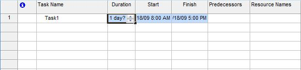

Tasks take time: they have a duration. Realistic task duration help give a realistic project end date. Aspose.Tasks allows developers set task duration in projects.

## **Working with Durations**
The Duration and DurationFormat properties exposed by the [Task](https://apireference.aspose.com/tasks/java/com.aspose.tasks/Task/) class are used to determine the planned duration and format of the duration of a task:

- Duration sets and gets a task's planned duration.
- DurationFormat sets and gets formats defined by the TimeUnitType enumeration.

### **Duration in Microsoft Project**
To see a task's duration in Microsoft Project one can select **More Views** and then **Task Entry** From the **View** menu.

**Setting task duration in Microsoft Project** 

### **Setting task duration using Aspose.Tasks**
The following examples increases and decreases the task duration to 1 week and half week respectively.


