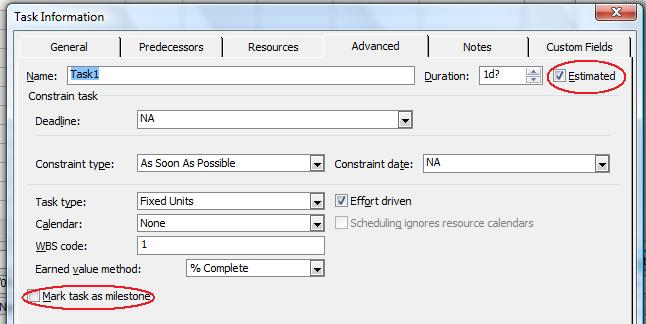

In Microsoft Project, milestones are used to monitor a project's progress. Milestones are crucial points in the project. Typically, a milestone's a task with no duration but any task can be marked as a milestone. Aspose.Tasks helps you manage milestones.

## **Working with Milestones**
The [Task](https://apireference.aspose.com/tasks/java/com.aspose.tasks/Task/) class exposes the IsEstimated and IsMilestone properties to manage estimated and milestone tasks:

- IsEstimated: set and get whether a task is estimated (boolean).
- IsMilestone: set and get whether a task is a milestone (boolean).

### **Viewing Estimated and Milestone Tasks in Microsoft Project**
To see whether a task is estimated or marked as a milestone in Microsoft Project double-click a task in the Task Entry form.

**Marking an estimated task as a milestone in Microsoft Project**

### **Finding out Whether a Task is Estimated or a Milestone**
The following code examples show how to find out whether a task is estimated or a milestone using Aspose.Tasks.


