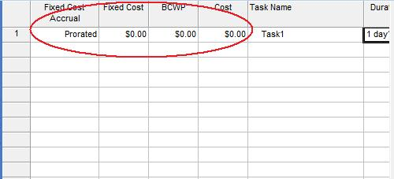

{} 

To estimate the cost of a project, tasks are associated with costs. Aspose.Tasks supports this feature of Microsoft Project with a range of properties.

{} 
## **Working with Task Cost**
The [Task](http://www.aspose.com/api/java/tasks/com.aspose.tasks/classes/Task) class exposes a number of properties for working with task cost:

- COST: a task's projected or scheduled cost (double).
- BCWP: the budgeted cost of the work performed to date (double).
- BCWS: the budgeted cost of scheduled work (double).
- FIXED_COST: the fixed cost associated with a task (single).
- FIXED_COST_ACCRUAL: the fixed cost accrued for a task (CostAccrualType).
### **Viewing Task Costs in Microsoft Project**
To view task costs in Microsoft Project:

1. On the Task Entry form, go to the **Insert** menu and select **Columns**.
1. Add the cost columns.

**Task cost in Microsoft Project** 

### **Getting Task Costs**
The following examples show how to get a tasks cost using Aspose.Tasks.


