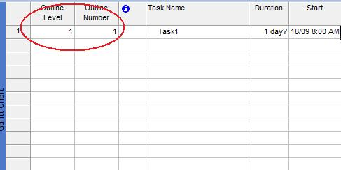

{} 

Microsoft Project has an outline structure that lets users get a quick overview of a project. Aspose.Tasks supports this functionality and lets developers control the outline number - where the task appears in a hierarchy - and the outline level - which level of the hierarchy the task is in.

{} 
## **Working with Outline Properties**
The [Tsk](http://www.aspose.com/api/java/tasks/com.aspose.tasks/classes/Tsk) class exposes the OUTLINE_NUMBER and OUTLINE_LEVEL properties for managing outlines associated with a class:

1. OutlineNumber (string).
1. OutlineLevel (integrer).
### **Outlines in Microsoft Project**
In Microsoft Project, outline number and outline level properties can be viewed on the Task Entry form by adding the columns:

1. On the **Insert** menu, select **columns**.
1. Add the OulineNumber and OutlineLevel columns.

**Outline properties in Microsoft Project** 

### **Getting Outline Properties in Aspose.Tasks**
The following example shows how to get the outline level and outline number information about a task using Aspose.Tasks.


