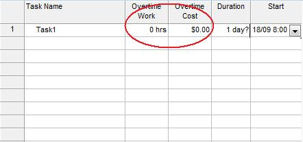

{} 

Microsoft Projects lets users assign overtime to tasks. Aspose.Tasks supports this functionality through two properties in the Task class.

{} 
## **Overtime**
The [Task](https://apireference.aspose.com/tasks/java/com.aspose.tasks/Task/) exposes several properties for working with overtime:

- OvertimeCost: reads and writes the sum of tasks, actual and remaining overtime cost (double).
- OvertimeWork: reads and writes the amount of overtime scheduled for a task (TimeSpan).
### **Microsoft Project view of task overtime**
To see a task's overtime work and cost properties:

1. In the Task Entry form, select the **Insert** menu and then **Column**.
1. Add the overtime columns.

**Overtime columns in Microsoft Project** 

### **Getting task overtimes in Aspose.Tasks**
The following examples show how to get the overtime cost and work associated with a task with Aspose.Tasks.


