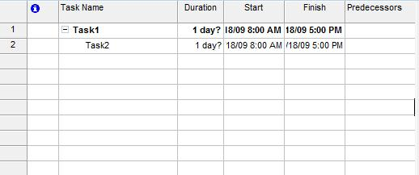

{} 

Tasks can be organized in a hierarchy. When a task has one or more tasks beneath it, they are referred to as parents. The tasks underneath are called parents.

{} 
## **Working with Parent Tasks and Children**
The [Task](https://apireference.aspose.com/tasks/java/com.aspose.tasks/Task/) class exposes classes that helps you determine:

- Parent: determines that a task is a parent task. Accepts and returns a Task object.
- Children: determines that a task is a child task. Accepts and returns an array list of Task objects.
### **Parent and Child Tasks in Microsoft Project**
To declare a task as a parent or a child task in Microsoft Project:

1. In the Task Entry form, select a task and click it.
2. Select **Outdent** to turn a task into a parent, or,
3. Select **Indent** to turn a task into a child.

**Parent tasks and children in Microsoft Project** 

### **Getting Parent and Child Tasks**
The following examples show viewing parent and child tasks in a project using Aspose.Tasks.



### **Setting Child Tasks**

