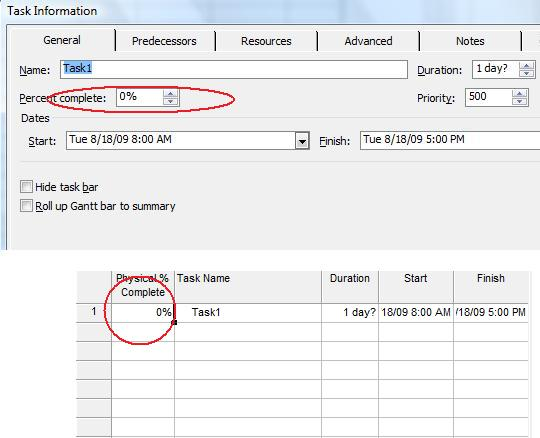

{} 

Microsoft Project shows the percentage of a task that's been completed. The percentage can be added manually, by a project manager, or automatically calculated by the application. Aspose.Tasks supports several percentage calculations related to tasks.

{} 
## **Percentages**
The [Task](https://apireference.aspose.com/tasks/java/com.aspose.tasks/Task/) class exposes several properties used to calculate percentages:

- PercentComplete represents the completed percentage of a task's duration (integer).
- PercentWorkComplete represents the completed percentage of a task's work (integer).
- PhysicalPercentComplete represents the completed percentage as entered by a project manager (integer).

To see the physical percent complete in Microsoft Project:

1. On the Task Entry form, from the **Insert** menu, select **Column**.
2. Add the column.

To see the completed percentage in Microsoft Project on the Task Entry form, double-click the desired column:

**A task's completed percentage in Microsoft Project, and, below it, it's physical completion percentage.**

### **Getting Percentages in Aspose.Tasks**
The following example shows how to get the percentages of work relating to tasks using Aspose.Tasks.


