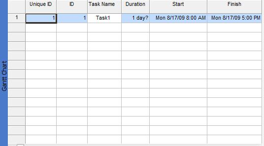

{} 

Tasks can be identified by a number of general properties, such as name, ID, start and finish date. Aspose.Tasks can be used to get and set task properties when working with projects.

{} 
## **General Properties**
The [Task](https://apireference.aspose.com/tasks/java/com.aspose.tasks/Task/) exposes several general properties:

- Name, used to set and get a task's name (string).
- Id, used to set and get a task's ID (integer).
- Uid, used to set and get a task's unique ID (integer).
- Start, used to set and get a task's start date (DateTime).
- Finish, used to set and get a task's end date (DateTime).

To view a task's general properties in Microsoft Project:

1. Open a project.
2. On the **View** menu, select **More Views** and then **Task Entry** to open the task entry form.
3. From the **Insert** menu, select **Column** and add the **ID** and **Unique ID** as shown in the screenshot below.

**Task general properties view in Microsoft Project** 

### **Setting General Properties**
To set the properties shown in the screenshot above, use the code below.



### **Getting General Properties**
Get a task's properties by traversing the children of the project's RootTask property.


